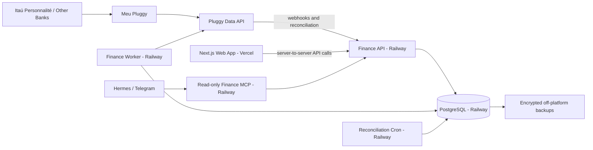
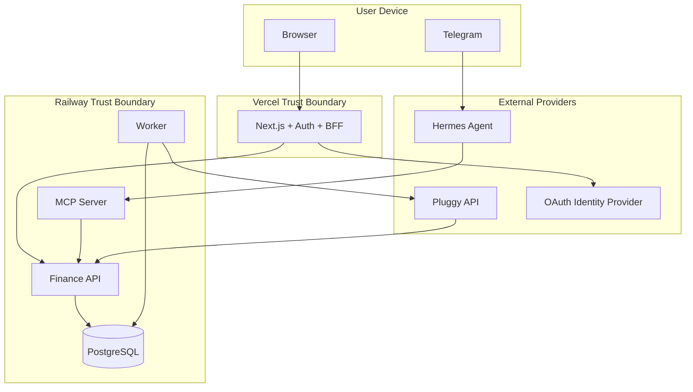
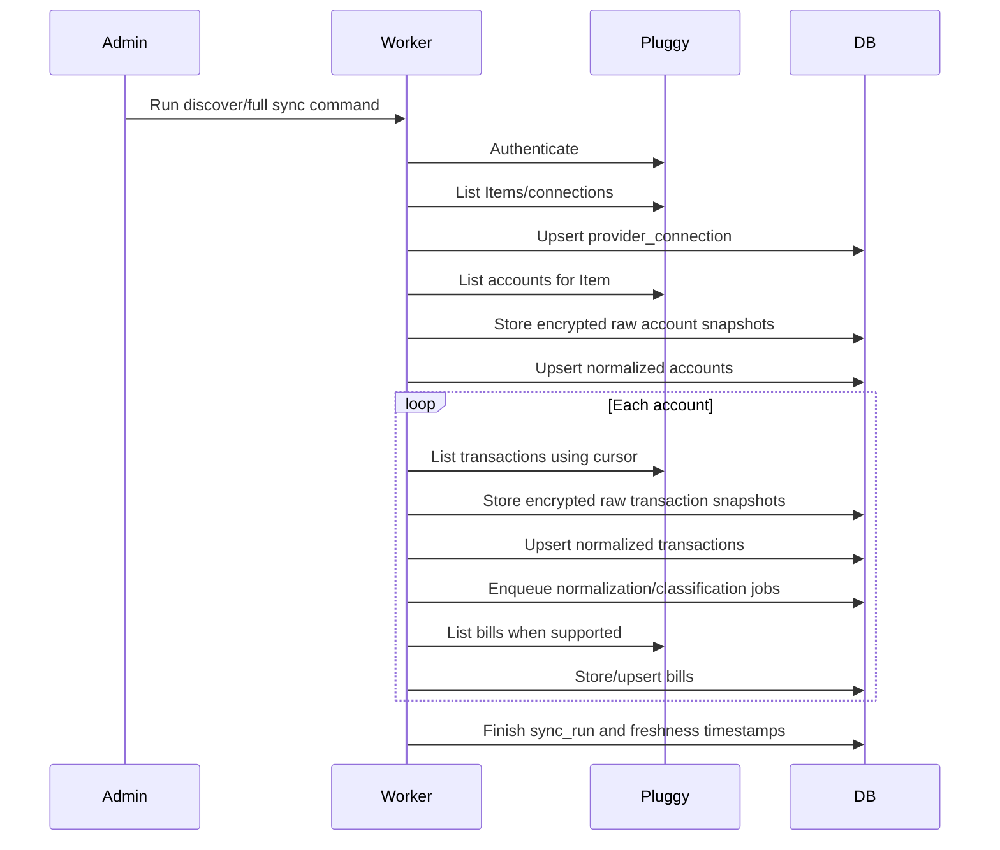

# CashCount Personal Finance Intelligence Platform

## Detailed Implementation Plan

This document is the implementation blueprint for a personal financial-data platform that imports the owner's banking and credit-card data through Meu Pluggy, stores and normalizes it in PostgreSQL, exposes deterministic analytics through a private API, and makes those analytics available through a web application and a read-only MCP server for Hermes or another compatible agent.

The design intentionally separates the valuable parts of the product—normalized financial history, merchant resolution, classification rules, analytics, and user corrections—from the Open Finance provider. Pluggy is an ingestion adapter, not the system of record.

> **Important product boundary:** the personal-use version must remain read-only with respect to financial institutions. It must not initiate Pix, transfers, payments, card operations, or any other movement of funds.

---

## 1. Executive Decision Summary

### 1.1 Recommended target architecture



### 1.2 Deployment allocation

| Platform | Responsibility |
|---|---|
| Vercel | Authenticated Next.js web interface and browser-facing backend-for-frontend routes |
| Railway | PostgreSQL, persistent API, persistent worker, scheduled reconciliation, and later the remote MCP server |
| Meu Pluggy / Pluggy Dashboard | Personal Open Finance connection and API credentials |
| Hermes | Natural-language client that calls narrowly scoped, read-only MCP tools |
| GitHub | Source control and continuous integration |

### 1.3 Technology decision

Use a TypeScript monorepo so frontend, API, worker, MCP tools, validation schemas, and domain types can share code without duplicating financial definitions.

Recommended baseline:

- Node.js `24.19.0` LTS, pinned in `.nvmrc`, `package.json#engines`, and CI.
- `pnpm` `11.22.0`, pinned through `packageManager`/Corepack, with workspaces and Turborepo.
- Next.js App Router on Vercel.
- Fastify for the Railway API.
- PostgreSQL on Railway.
- Drizzle ORM for schema and migrations, with explicit SQL for analytics views and complex queries.
- Zod for runtime validation and shared API contracts.
- Vitest for unit and integration tests.
- Playwright for web end-to-end tests.
- Official MCP TypeScript SDK for the remote MCP server.
- Pino structured logging.

### 1.4 Core architectural rules

1. PostgreSQL is the source of truth.
2. Pluggy is accessed only from Railway backend services.
3. Pluggy `CLIENT_SECRET`, API keys, webhook secrets, and encryption keys never reach the browser.
4. The Vercel frontend does not connect directly to PostgreSQL.
5. The browser does not call the Railway API with a privileged service token. Next.js server routes and server components act as a backend-for-frontend.
6. Webhook processing is idempotent and asynchronous.
7. Every financial total is computed by tested code or SQL, never by an LLM.
8. Hermes receives narrowly scoped results, not unrestricted SQL access or full raw financial records.
9. Provider-specific fields remain inside an adapter and raw-data layer.
10. The personal MVP contains a workspace boundary from day one so a later multi-user version does not require rebuilding the schema.
11. Provider facts, deterministic system interpretation, and user-owned decisions are stored separately.
12. The MCP service calls the Finance API with a dedicated read-only credential and never connects directly to PostgreSQL.
13. Every runtime repository query and workspace-owned foreign key is workspace-scoped.

---

## 2. Product Goal and Scope

### 2.1 Product goal

Build **CashCount**, a reliable personal finance intelligence system that can answer questions such as:

- How much did I spend by category, merchant, card, or period?
- How does this month compare with previous months at the same point in the month?
- Which expenses are recurring?
- How much is already committed in future installments?
- Which transactions remain uncategorized or uncertain?
- Which merchants or categories have increased unusually?
- What is the difference between purchase-based spending and bank-account cash flow?
- When was each account last synchronized, and how fresh is the data?

### 2.2 Personal MVP scope

The first complete version must include:

- Meu Pluggy personal connection.
- Import of accounts, credit cards, transactions, and card bills when available.
- Immutable encrypted storage of provider payloads.
- Normalized financial accounts and transactions.
- Merchant normalization and aliases.
- Hierarchical categories and user-defined rules.
- Manual transaction correction.
- Idempotent webhooks plus scheduled reconciliation.
- Spending, cash-flow, installment, merchant, and recurring-expense analytics.
- Authenticated web dashboard.
- Read-only MCP tools for Hermes.
- Data freshness, auditability, backup, and restore procedures.

### 2.3 Explicitly outside the personal MVP

Do not implement these in the initial product:

- Pix, transfers, bill payment, or any payment initiation.
- Direct bank credentials or screen-scraping logic.
- Native iOS or Android applications.
- Public registration or multi-tenant customer onboarding.
- Shared household editing.
- Tax, investment, legal, or credit advice.
- Automatic financial decisions made by an LLM.
- A generic “run SQL” MCP tool.
- True real-time guarantees.
- Complex machine-learning infrastructure or a vector database.
- Microservices beyond the few operational processes defined here.

### 2.4 Success criteria

The personal MVP is successful when all of the following are true:

- A complete initial import succeeds for all connected personal accounts available through Meu Pluggy.
- Running the same full synchronization three consecutive times creates no duplicate normalized transactions.
- Provider-created, updated, and deleted transaction events are applied correctly and idempotently.
- Card purchases are not counted a second time when the card bill is paid from a checking account.
- Internal transfers are not presented as income or spending.
- Refunds reduce spending correctly.
- Pending-to-posted transaction changes preserve history and do not create duplicates.
- Every analytics response includes an `asOf` or freshness timestamp.
- Manual notes, review state, tags, and field-level corrections survive synchronization and confirmed provider-ID replacement.
- Missing provider category and merchant enrichment does not break required workflows.
- Mixed-currency and incomplete-history data produces explicit warnings rather than misleading totals.
- Hermes can answer the supported questions only through typed tools.
- The database can be restored from a tested backup.
- A mixed-version encryption-key rotation can be interrupted, resumed, verified, and completed without losing decryptability.
- PostgreSQL rejects tested cross-workspace references even when application validation is bypassed.
- Secrets, authorization headers, raw payloads, account identifiers, and CPF values never appear in application logs.

---

## 3. Key Assumptions and Constraints

### 3.1 Personal Pluggy path

For personal use, the owner connects nominal accounts in Meu Pluggy, creates an application in the Pluggy Dashboard, links those Meu Pluggy connections to the application, and uses the issued `Client ID` and `Client Secret` from the backend. Pluggy currently states that this personal API path is free without an expiration date, but it cannot be used commercially or for multiple customers. Treat that policy as a contractual dependency and re-check it before every commercial decision.

### 3.2 Data availability is asynchronous

The platform must describe synchronization as automatic, not instantaneous. A webhook means that Pluggy has detected or synchronized a change; it does not guarantee that a card purchase appeared immediately after authorization at the merchant.

### 3.3 Time and currency

- Default display timezone: `America/Sao_Paulo`.
- Store ingestion and system timestamps as `timestamptz` in UTC.
- Store bank transaction dates as PostgreSQL `date` where the provider supplies a banking date without a reliable time.
- Default currency: `BRL`.
- Retain the ISO currency code on every amount-bearing record.
- Use PostgreSQL `numeric(20,6)` and serialize monetary values as strings in JSON. Never use JavaScript binary floating-point values for persisted financial arithmetic.

### 3.4 Availability model

This is initially a personal system, not a regulated high-availability banking platform. Nevertheless, data integrity, idempotency, backup, and restoration are mandatory because losing a normalized history would undermine the project's value.

### 3.5 Provider history and enrichment coverage

- Pluggy currently describes transaction retrieval as **up to 12 months**. This is a maximum, not a guarantee for every institution or account.
- Measure actual earliest/latest coverage per account and warn whenever a requested comparison predates known coverage.
- Provider category and merchant enrichment fields are optional and may be unavailable on the personal plan. Import, classification, analytics, UI, and MCP behavior must work when both are null.
- A later owner-supplied history import may extend coverage, but it must remain distinguishable from provider-retrieved history.

---

## 4. System Context and Trust Boundaries

### 4.1 Trust boundaries



### 4.2 Public endpoints

Only the following Railway routes should be publicly reachable:

- API health endpoint.
- Authenticated Vercel-to-API routes.
- Pluggy webhook endpoint.
- MCP endpoint after the MCP phase is enabled.

PostgreSQL must remain private inside the Railway project. Public TCP access should be disabled in production except for a temporary, controlled maintenance operation.

### 4.3 Authentication paths

#### Web application

1. User authenticates to Next.js through Auth.js using a single selected OAuth provider.
2. The application denies access unless the authenticated email equals `ALLOWED_USER_EMAIL`.
3. Browser requests are handled by Next.js server components, route handlers, or server actions.
4. Next.js calls the Railway API using a server-only service credential.
5. The service credential is never exposed in HTML, JavaScript bundles, client components, browser storage, or network requests originating from the browser.

#### Pluggy webhook

1. Configure a high-entropy `Authorization` or custom header when creating the Pluggy webhook.
2. Verify that header using constant-time comparison.
3. Validate the payload with Zod.
4. Insert the event into the webhook inbox using a unique `eventId` constraint.
5. Return `202 Accepted` immediately.
6. Let the worker retrieve the current provider object and process it.

IP allow-listing may be used only as defense in depth because provider IPs can change. The custom secret header and event verification remain primary controls.

#### Hermes/MCP

For personal use, protect the remote HTTPS MCP endpoint with `MCP_CLIENT_TO_MCP_TOKEN`. The MCP service calls the Finance API over Railway private networking using a different credential, `MCP_TO_API_READONLY_TOKEN`. Neither credential may be reused as `WEB_TO_API_TOKEN` or `PLUGGY_WEBHOOK_SECRET`. The API maps each credential to a fixed role and workspace; callers never select their own role or workspace. The first MCP release is read-only. A later commercial release should replace the static client token with per-user OAuth 2.1 and scoped authorization.

---

## 5. Repository and Project Structure

Use one Git repository.

```text
cashcount/
├── apps/
│   ├── web/                     # Next.js on Vercel
│   ├── api/                     # Fastify API on Railway
│   ├── worker/                  # Persistent PostgreSQL-backed job worker
│   └── mcp/                     # Remote read-only MCP server, added later
├── packages/
│   ├── config/                  # Environment schemas and shared configuration
│   ├── contracts/               # Zod request/response schemas and public types
│   ├── db/                      # Drizzle schema, migrations, repositories, SQL views
│   ├── domain/                  # Money, date, transaction, category, and policy logic
│   ├── provider-core/           # Provider-neutral interfaces and normalized DTOs
│   ├── provider-pluggy/         # Pluggy API client and mapping code
│   ├── classification/          # Merchant normalization and rule engine
│   ├── analytics/               # Deterministic analytics services and queries
│   ├── observability/           # Logging, redaction, tracing helpers
│   └── test-fixtures/           # Sanitized provider payloads and builders
├── scripts/
│   ├── discover-pluggy-items.ts
│   ├── full-sync.ts
│   ├── reconcile.ts
│   ├── rotate-secrets.md
│   ├── backup.sh
│   └── restore-test.sh
├── docs/
│   ├── architecture.md
│   ├── accounting-policy.md
│   ├── data-dictionary.md
│   ├── runbooks/
│   └── adr/
├── infra/
│   ├── docker-compose.yml       # Local PostgreSQL only
│   ├── railway.md
│   └── vercel.md
├── .github/
│   └── workflows/
├── AGENTS.md
├── .env.example
├── package.json
├── pnpm-workspace.yaml
├── turbo.json
├── tsconfig.base.json
└── README.md
```

### 5.1 Package boundaries

- `provider-pluggy` may import `provider-core`, `contracts`, and `observability`.
- `domain` must not import Pluggy-specific packages.
- `analytics` may depend on `domain` and `db`, but not on web or MCP.
- `api`, `worker`, and `mcp` may orchestrate packages but should contain little domain logic.
- `web` consumes API contracts but never imports server database code.
- No package may read `process.env` directly except `packages/config` and application entrypoints.

### 5.2 Required root scripts

Codex should create and maintain at least these scripts:

```json
{
  "scripts": {
    "dev": "turbo dev",
    "build": "turbo build",
    "lint": "turbo lint",
    "typecheck": "turbo typecheck",
    "test": "turbo test",
    "test:integration": "turbo test:integration",
    "test:e2e": "turbo test:e2e",
    "db:generate": "pnpm --filter @cashcount/db db:generate",
    "db:migrate": "pnpm --filter @cashcount/db db:migrate",
    "db:seed": "pnpm --filter @cashcount/db db:seed",
    "sync:discover": "pnpm --filter @cashcount/worker sync:discover",
    "sync:full": "pnpm --filter @cashcount/worker sync:full",
    "sync:reconcile": "pnpm --filter @cashcount/worker sync:reconcile",
    "mcp:inspect": "pnpm --filter @cashcount/mcp inspect"
  }
}
```

The exact package names may be adjusted, but the capabilities and separation must remain.

---

## 6. Environment Strategy

### 6.1 Environments

Create three logical environments:

| Environment | Purpose | Data policy |
|---|---|---|
| Local | Development with Docker PostgreSQL and sanitized fixtures | No production secrets by default |
| Development | Railway/Vercel integration testing | Prefer sandbox or a deliberately limited personal connection |
| Production | Personal live system | Real financial data; strict access and backup controls |

Never point a Vercel preview deployment at the production API by default. Preview deployments should either be disabled for authenticated data routes or use the development API and database.

### 6.2 Environment variables

#### Railway API and worker

```text
NODE_ENV
APP_TIMEZONE=America/Sao_Paulo
DEFAULT_CURRENCY=BRL
DATABASE_URL
PLUGGY_CLIENT_ID
PLUGGY_CLIENT_SECRET
PLUGGY_WEBHOOK_SECRET
PLUGGY_BASE_URL=https://api.pluggy.ai
DATA_ENCRYPTION_ACTIVE_KEY_VERSION
DATA_ENCRYPTION_KEYRING_JSON
WEB_TO_API_TOKEN
MCP_TO_API_READONLY_TOKEN
WEB_APP_URL
API_PUBLIC_URL
API_PRIVATE_URL
LOG_LEVEL
SENTRY_DSN                  # optional
```

This list is the union for Railway backend services, not permission to expose every value to every process. The API receives database/keyring, webhook, web-token, and MCP-read-token values; the worker receives database/keyring and Pluggy credentials. Give a service only the variables it consumes.

#### Vercel web application

```text
AUTH_SECRET
AUTH_GITHUB_ID              # or another selected provider
AUTH_GITHUB_SECRET
ALLOWED_USER_EMAIL
FINANCE_API_BASE_URL
WEB_TO_API_TOKEN
NEXT_PUBLIC_APP_NAME
```

#### Railway MCP service

```text
MCP_PUBLIC_URL
FINANCE_API_PRIVATE_URL
MCP_CLIENT_TO_MCP_TOKEN
MCP_TO_API_READONLY_TOKEN
MCP_RATE_LIMIT_PER_MINUTE
```

#### Local-only convenience

```text
ALLOW_DEV_AUTH_BYPASS=false
LOCAL_DATABASE_URL
```

Rules:

- No secret may use the `NEXT_PUBLIC_` prefix.
- `.env.example` contains names and descriptions only.
- Production secrets are entered directly in Vercel and Railway.
- Generate secrets with a cryptographically secure generator; do not invent human-readable passwords.
- Each key in `DATA_ENCRYPTION_KEYRING_JSON` must decode to exactly 32 bytes; the active version must exist in the keyring.
- Each trust-boundary token must contain at least 256 bits of cryptographically random entropy and rotate independently.
- Production startup fails if credential reuse is detected where the values are available to the same process.

---

## 7. Security and Privacy Model

### 7.1 Data minimization

Persist only what the system needs.

- Do not persist bank login credentials.
- Do not persist CPF unless an unavoidable provider field requires it; prefer dropping it during normalization.
- Store only masked account/card numbers and last four digits.
- Never return provider `Item` IDs, account identifiers, or raw payloads to Hermes.
- Do not include transaction payloads or authorization headers in logs.
- Do not store AI prompts containing full unfiltered transaction exports.

### 7.2 Raw payload encryption

The raw layer is valuable for reprocessing but sensitive. Encrypt raw provider payloads at application level with AES-256-GCM using a versioned keyring.

For each encrypted payload, store:

- ciphertext;
- random nonce/IV;
- authentication tag;
- key version;
- SHA-256 hash of the canonical plaintext for change detection;
- provider entity type and external identifier;
- observation timestamp.

Canonicalize parsed JSON with one versioned deterministic algorithm (RFC 8785/JCS-compatible unless an ADR selects an equivalent) before hashing. Record/test the canonicalization version so a library change cannot create unexplained snapshot churn.

Do not reuse nonces. Keep key material in Railway secrets, not in PostgreSQL. New writes always use `DATA_ENCRYPTION_ACTIVE_KEY_VERSION`; reads select the key recorded on the row. Validate that every configured key version is a canonical positive integer whose Base64 value decodes to exactly 32 bytes, and fail closed if the active version is absent.

Bind each ciphertext to stable additional authenticated data containing at least `workspace_id`, storage table, record ID, provider, entity/event type, external ID/event ID, and key version. Moving ciphertext to a different row or workspace must therefore fail authentication.

Key rotation is resumable and durable: add the new key while retaining old keys, make it active for new writes, re-encrypt `provider_raw_object` and `webhook_event` in bounded batches tracked by `encryption_rotation_run`, verify no row still uses the old version, take and test an off-platform backup, then remove the retired key only in a later deployment. A key must never be removed merely because it is no longer active.

Structured analytics fields—date, amount, merchant, category—remain queryable in PostgreSQL. Particularly sensitive identity fields should be omitted, hashed, or separately encrypted.

### 7.3 Logging redaction

Create a centralized Pino redaction configuration. At minimum redact keys matching:

```text
authorization
cookie
set-cookie
clientSecret
client_secret
apiKey
api_key
token
accessToken
refreshToken
password
cpf
cnpj
accountNumber
cardNumber
rawPayload
payloadEncrypted
```

Use allow-listed structured fields instead of logging arbitrary request bodies.

### 7.4 Access control

Personal MVP roles:

- `owner`: full web application access.
- `service_web`: server-to-server read/write API access required by the web BFF.
- `service_worker`: ingestion and classification access.
- `service_mcp_readonly`: analytics-only access.
- `service_webhook`: event ingestion only.

Implement these as separate secrets and code paths even if they initially map to a small number of static bearer tokens. This prevents the MCP token from gaining administrative capabilities.

Concrete credential boundaries:

| Credential | Caller | Receiver | Capability |
|---|---|---|---|
| `WEB_TO_API_TOKEN` | Next.js server | Finance API | Owner web read/write routes |
| `MCP_CLIENT_TO_MCP_TOKEN` | Hermes | MCP server | Approved MCP tools only |
| `MCP_TO_API_READONLY_TOKEN` | MCP server | Finance API | Bounded read-only finance routes |
| `PLUGGY_WEBHOOK_SECRET` | Pluggy | Webhook route | Authenticated inbox insert only |

Compare static tokens in constant time, never log values or prefixes, and generate a separate worker credential if the worker ever needs to call the API. The worker normally uses shared repositories directly.

### 7.5 Dependency and supply-chain controls

- Commit `pnpm-lock.yaml`.
- Use exact or controlled semver ranges.
- Enable Dependabot or Renovate.
- Run dependency audits in CI, but review updates rather than merging blindly.
- Pin GitHub Actions by major version at minimum; pin by commit for high-assurance workflows.
- Generate an SBOM before commercialization.

### 7.6 LLM privacy boundary

The MCP layer returns the smallest useful result. Prefer:

```json
{
  "period": { "from": "2026-08-01", "to": "2026-08-22" },
  "category": "restaurants",
  "amount": "1847.42",
  "currency": "BRL",
  "comparisonPercent": "18.20",
  "asOf": "2026-08-22T20:15:03Z"
}
```

Avoid sending hundreds of full transactions unless the user explicitly asks for a bounded list. Set strict result limits, require date ranges for detailed queries, and record every MCP tool invocation in an audit table.

---

## 8. Financial and Accounting Policy

A finance tracker becomes unreliable when it treats every debit as spending and every credit as income. The application must encode an explicit policy before analytics are built.

### 8.1 Two separate views

#### Spending view

Answers: “What did I buy or consume?”

- Count card purchases on the purchase/posting date.
- Count checking-account purchases and fees.
- Subtract refunds and chargebacks.
- Exclude payment of a credit-card bill from spending because the underlying purchases were already counted.
- Exclude transfers between the owner's accounts.

#### Cash-flow view

Answers: “What money entered or left my deposit accounts?”

- Include actual checking/savings inflows and outflows.
- Include card-bill payment as a cash outflow.
- Exclude internal transfers from net external cash flow.
- Do not replace the spending view with this view; present both explicitly.

### 8.2 Transaction dimensions

Every normalized transaction needs two independent concepts:

```text
direction:       INFLOW | OUTFLOW | NEUTRAL | UNKNOWN
financial_role:  PURCHASE | INCOME | TRANSFER | CARD_BILL_PAYMENT |
                 REFUND | FEE | TAX | CASH_WITHDRAWAL | ADJUSTMENT |
                 INVESTMENT_MOVEMENT | CREDIT | UNKNOWN_CREDIT | UNKNOWN
```

A card refund can be an inflow with role `REFUND`. A salary deposit is an inflow with role `INCOME`. A checking-account debit that pays the card is an outflow with role `CARD_BILL_PAYMENT`.

### 8.3 Spend calculation

Conceptually:

```sql
CASE
  WHEN effective_financial_role IN ('PURCHASE', 'FEE', 'TAX')
    THEN analytics_amount_magnitude
  WHEN effective_financial_role IN ('REFUND', 'CREDIT')
    THEN -analytics_amount_magnitude
  ELSE 0
END
```

`provider_amount_signed` remains immutable provider evidence. `analytics_amount_magnitude` is a Decimal/SQL absolute value selected under the currency policy from the account-currency amount when present or the compatible original-currency amount. Direction, role, account type, and reconciliation evidence carry economic semantics.

### 8.4 Installment policy

- Store each provider-reported installment as an actual transaction.
- Store provider metadata such as current installment number, total installments, and total purchase amount.
- Build an `installment_series` that links known installments.
- Remaining installments are projections, not actual transactions.
- Never insert synthetic future installments into the primary `transactions` table.
- Present at least two metrics:
  - amount posted in the selected period;
  - future committed amount estimated from remaining installments.

### 8.5 Pending and posted policy

- Preserve pending transactions.
- If a pending provider transaction becomes posted under the same external ID, update the normalized record and preserve a revision.
- If the provider changes the external ID, attempt a conservative match based on account, amount, description, dates, and installment metadata.
- Never automatically merge low-confidence matches. Mark them for review.

### 8.6 Transfer policy

Detect internal transfers using conservative matching:

- opposite directions;
- same currency and amount;
- transaction dates within a configurable window, initially two days;
- both accounts belong to the same workspace;
- descriptions or provider metadata indicate a transfer.

Store a transfer pair link. Do not erase either source transaction.

### 8.7 Policy versioning

Create `docs/accounting-policy.md` and a small `analytics_policy_version` configuration value. When formulas materially change, increment the version and include it in analytics responses so historical reports remain explainable.

### 8.8 Provider amount and currency policy

- Preserve the exact signed provider amount and provider `DEBIT`/`CREDIT` type. Never infer local direction from sign alone.
- Preserve `amountInAccountCurrency` separately when supplied. Do not fabricate it.
- Credit-card positive amounts normally increase the outstanding balance; negative amounts may be refunds, credits, or payments and remain unresolved until supporting evidence identifies the role.
- Base-currency analytics use the account-currency amount when available; otherwise they use the original amount only when its currency equals the account currency. Non-convertible rows are omitted from the base-currency total with a structured warning/count or grouped by currency.

### 8.9 Bill-payment and finance-charge policy

A bill payment may appear in bill `payments`, as a negative card transaction, and as a checking-account debit. Treat these as linked evidence for one economic event. Spending excludes all bill-payment representations; cash flow includes only the confirmed bank-account outflow. A negative card amount is never automatically a bill payment.

Normalize bill finance charges and payments. A finance charge counts once when a matching financial transaction exists. If the charge exists only as bill metadata, show an unreconciled component instead of silently creating synthetic spending.

### 8.10 Provider timestamp and replacement policy

Store the immutable provider UTC timestamp and derive a local financial `date` with the workspace IANA timezone. Do not hard-code `UTC-3`.

When Pluggy deletes a transaction and creates a replacement ID, preserve both provider records and create a scored continuity candidate. Transfer user notes, tags, review state, and field overrides only after a high-confidence unambiguous match or explicit user confirmation, with complete audit history.


---

## 9. PostgreSQL Data Model

### 9.1 General database conventions

- Table and column names: `snake_case`.
- Primary keys: UUID generated in application code or PostgreSQL.
- All mutable tables: `created_at timestamptz not null`, `updated_at timestamptz not null`.
- Soft deletion where provider history matters: `deleted_at timestamptz`.
- Monetary columns: `numeric(20,6)`.
- Currency: `char(3)` validated as uppercase ISO-style code.
- Provider payload identifiers: text, because external formats may change.
- Use PostgreSQL enums only for highly stable concepts; otherwise use text plus check constraints to reduce migration friction.
- Every user-owned record must include `workspace_id` either directly or through an unambiguous parent.
- Migrations are append-only after production deployment. Never edit a migration that has run in production.

### 9.2 Tenancy and identity tables

#### `app_user`

| Column | Type | Notes |
|---|---|---|
| `id` | uuid | Primary key |
| `email` | citext | Unique, normalized |
| `display_name` | text | Optional |
| `auth_provider` | text | Selected identity provider, for example `github` or `google` |
| `auth_subject` | text | Subject from the selected identity provider |
| `status` | text | `ACTIVE`, `DISABLED` |
| timestamps | timestamptz | Standard |

Unique constraint: `(auth_provider, auth_subject)`. Require a provider-verified email before applying the `ALLOWED_USER_EMAIL` gate.

#### `workspace`

| Column | Type | Notes |
|---|---|---|
| `id` | uuid | Primary key |
| `name` | text | Example: `Raphael Personal Finance` |
| `base_currency` | char(3) | Default `BRL` |
| `timezone` | text | Default `America/Sao_Paulo` |
| `analytics_policy_version` | integer | Starts at 1 |
| timestamps | timestamptz | Standard |

#### `workspace_member`

| Column | Type | Notes |
|---|---|---|
| `workspace_id` | uuid | FK |
| `user_id` | uuid | FK |
| `role` | text | Initially `OWNER` only |
| timestamps | timestamptz | Standard |

Primary key: `(workspace_id, user_id)`.

### 9.3 Provider and synchronization tables

#### `provider_connection`

Represents one Pluggy Item or an equivalent connection from a future provider.

| Column | Type | Notes |
|---|---|---|
| `id` | uuid | Primary key |
| `workspace_id` | uuid | FK |
| `provider` | text | `PLUGGY` initially |
| `external_connection_id` | text | Pluggy Item ID |
| `external_connector_id` | text | Provider connector ID |
| `display_name` | text | Safe local label |
| `local_status` | text | `ACTIVE`, `SYNCING`, `USER_INPUT_REQUIRED`, `USER_ACTION_REQUIRED`, `REAUTH_REQUIRED`, `PROVIDER_ERROR`, `DELETED`, `DISABLED` |
| `provider_item_status` | text | Latest provider Item status, nullable |
| `provider_execution_status` | text | Latest provider execution status, nullable |
| `action_required_at` | timestamptz | Nullable |
| `consent_expires_at` | timestamptz | Nullable |
| `last_attempt_at` | timestamptz | Nullable |
| `last_successful_sync_at` | timestamptz | Nullable |
| `last_provider_update_at` | timestamptz | Nullable |
| `last_error_code` | text | Redacted |
| `last_error_summary` | text | Redacted and bounded |
| `metadata` | jsonb | Non-secret operational metadata only |
| timestamps | timestamptz | Standard |
| `deleted_at` | timestamptz | Nullable |

Constraint: unique `(workspace_id, provider, external_connection_id)`.

Do not store raw provider messages in plaintext. Retain only a bounded owner-safe summary; full evidence remains encrypted.

#### `provider_raw_object`

Logically immutable provider snapshots. Plaintext evidence and identity never change; only the encrypted envelope/key version may be replaced by an audited key-rotation run.

| Column | Type | Notes |
|---|---|---|
| `id` | uuid | Primary key |
| `workspace_id` | uuid | FK |
| `provider` | text | `PLUGGY` |
| `entity_type` | text | `ITEM`, `ACCOUNT`, `TRANSACTION`, `BILL`, `IDENTITY`, etc. |
| `external_id` | text | Provider object ID |
| `payload_ciphertext` | bytea | AES-GCM ciphertext |
| `payload_iv` | bytea | Unique nonce |
| `payload_tag` | bytea | Authentication tag |
| `key_version` | integer | Encryption key version |
| `payload_sha256` | char(64) | Canonical plaintext hash |
| `source_event_id` | text | Nullable |
| `observed_at` | timestamptz | When fetched |
| `provider_updated_at` | timestamptz | Nullable |

Index `(provider, entity_type, external_id, observed_at desc)`.

Do not make this table the query source for routine application pages. It is an immutable evidence and reprocessing layer.

#### `webhook_event`

| Column | Type | Notes |
|---|---|---|
| `id` | uuid | Primary key |
| `workspace_id` | uuid | Nullable only when the incoming Item cannot be mapped |
| `provider` | text | `PLUGGY` |
| `external_event_id` | text | Unique Pluggy `eventId` |
| `event_type` | text | Example `transactions/created` |
| `external_connection_id` | text | Nullable |
| `external_account_id` | text | Nullable |
| `payload_ciphertext` | bytea | Encrypted original payload |
| encryption fields | bytea/int | IV, tag, key version |
| `payload_sha256` | char(64) | Integrity/dedupe support |
| `received_at` | timestamptz | Required |
| `status` | text | `RECEIVED`, `QUEUED`, `PROCESSED`, `FAILED`, `IGNORED`, `UNMAPPED` |
| `processed_at` | timestamptz | Nullable |
| `attempt_count` | integer | Default 0 |
| `last_error_summary` | text | Redacted |

Use an expression unique index on `(coalesce(workspace_id, zero-uuid), provider, external_event_id)` so mapped and unmapped retries deduplicate consistently. An unmapped event creates a safe alert and remains available for repair.

#### `job_queue`

A PostgreSQL-backed durable queue removes the need for Redis in the MVP.

| Column | Type | Notes |
|---|---|---|
| `id` | uuid | Primary key |
| `workspace_id` | uuid | Nullable for system jobs |
| `job_type` | text | `PROCESS_WEBHOOK`, `SYNC_CONNECTION`, `SYNC_ACCOUNT`, `CLASSIFY_TRANSACTION`, etc. |
| `payload` | jsonb | Internal IDs only; no secrets/raw payload |
| `dedupe_key` | text | Nullable |
| `status` | text | `PENDING`, `RUNNING`, `SUCCEEDED`, `RETRY`, `DEAD` |
| `priority` | integer | Higher values run first |
| `available_at` | timestamptz | Retry scheduling |
| `locked_at` | timestamptz | Nullable |
| `locked_by` | text | Worker instance ID |
| `started_at` | timestamptz | First successful claim time |
| `heartbeat_at` | timestamptz | Last worker heartbeat |
| `lease_expires_at` | timestamptz | Reclaim boundary |
| `finished_at` | timestamptz | Terminal completion time |
| `attempt_count` | integer | Default 0 |
| `max_attempts` | integer | Default based on job type |
| `last_error_code` | text | Redacted |
| `last_error_summary` | text | Redacted |
| timestamps | timestamptz | Standard |

Add a partial unique index on `(coalesce(workspace_id, zero-uuid), job_type, dedupe_key)` for non-null dedupe keys while status is `PENDING`, `RETRY`, or `RUNNING`.

Worker acquisition pattern:

```sql
SELECT id
FROM job_queue
WHERE status IN ('PENDING', 'RETRY')
  AND available_at <= now()
ORDER BY priority DESC, created_at
FOR UPDATE SKIP LOCKED
LIMIT 1;
```

Claim and mark the selected row `RUNNING` atomically with `UPDATE ... RETURNING` in the same transaction. On claim, set a 120-second lease and heartbeat; heartbeat at least every 30 seconds during long work. Reclaim only expired leases. Completion must compare `locked_by`, `RUNNING` status, and an unexpired lease so a worker that lost ownership cannot commit success.

#### `sync_run`

| Column | Type | Notes |
|---|---|---|
| `id` | uuid | Primary key |
| `workspace_id` | uuid | FK |
| `provider_connection_id` | uuid | FK |
| `trigger_type` | text | `INITIAL`, `WEBHOOK`, `MANUAL`, `SCHEDULED`, `RECOVERY` |
| `status` | text | `RUNNING`, `SUCCEEDED`, `PARTIAL`, `FAILED` |
| `started_at` | timestamptz | Required |
| `finished_at` | timestamptz | Nullable |
| `accounts_seen` | integer | Default 0 |
| `transactions_seen` | integer | Default 0 |
| `transactions_inserted` | integer | Default 0 |
| `transactions_updated` | integer | Default 0 |
| `transactions_deleted` | integer | Default 0 |
| `bills_seen` | integer | Default 0 |
| `cursor_state` | jsonb | Non-secret pagination state |
| `error_summary` | text | Redacted |

### 9.4 Financial account tables

#### `financial_account`

| Column | Type | Notes |
|---|---|---|
| `id` | uuid | Primary key |
| `workspace_id` | uuid | FK |
| `provider_connection_id` | uuid | FK |
| `provider` | text | `PLUGGY` |
| `external_account_id` | text | Provider account ID |
| `account_type` | text | `CHECKING`, `SAVINGS`, `CREDIT_CARD`, `INVESTMENT`, `OTHER` |
| `account_subtype` | text | Provider-normalized subtype |
| `name` | text | Safe display name |
| `institution_name` | text | Example `Itaú` |
| `currency` | char(3) | Required |
| `masked_number` | text | Last digits only |
| `current_balance` | numeric(20,6) | Nullable |
| `available_balance` | numeric(20,6) | Nullable |
| `credit_limit` | numeric(20,6) | Nullable |
| `available_credit_limit` | numeric(20,6) | Nullable |
| `closing_day` | smallint | Nullable, 1-31 |
| `due_day` | smallint | Nullable, 1-31 |
| `is_active` | boolean | Default true |
| `provider_updated_at` | timestamptz | Nullable |
| `last_successful_sync_at` | timestamptz | Nullable |
| `latest_raw_object_id` | uuid | Nullable FK |
| `provider_history_earliest_date` | date | Earliest provider transaction observed |
| `provider_history_latest_date` | date | Latest provider transaction observed |
| `initial_import_completed_at` | timestamptz | Nullable |
| `history_coverage_status` | text | `UNKNOWN`, `PARTIAL`, `PROVIDER_MAXIMUM_RETRIEVED`, `USER_EXTENDED_HISTORY` |
| `history_coverage_note` | text | Bounded and non-sensitive |
| timestamps | timestamptz | Standard |
| `deleted_at` | timestamptz | Nullable |

Constraint: unique `(workspace_id, provider, external_account_id)`.

#### `credit_card_bill`

| Column | Type | Notes |
|---|---|---|
| `id` | uuid | Primary key |
| `workspace_id` | uuid | FK |
| `financial_account_id` | uuid | Must point to credit-card account |
| `provider` | text | `PLUGGY` |
| `external_bill_id` | text | Provider ID |
| `status` | text | Provider-normalized |
| `due_date` | date | Nullable |
| `close_date` | date | Nullable |
| `total_amount` | numeric(20,6) | Nullable |
| `minimum_payment` | numeric(20,6) | Nullable |
| `currency` | char(3) | Required |
| `allows_installments` | boolean | Nullable provider value |
| `provider_status` | text | Raw normalized provider status |
| `reconciliation_status` | text | Optional cached status; canonical result may be a view |
| `latest_raw_object_id` | uuid | Nullable |
| timestamps | timestamptz | Standard |

Constraint: unique `(workspace_id, provider, external_bill_id)`.

#### `credit_card_bill_payment`

Normalize each provider bill payment as reconciliation evidence.

| Column | Type | Notes |
|---|---|---|
| `id` | uuid | Primary key |
| `workspace_id` | uuid | Required |
| `credit_card_bill_id` | uuid | Composite workspace FK |
| `provider` | text | `PLUGGY` initially |
| `external_payment_id` | text | Provider payment ID |
| `value_type` | text | Example `FULL_PAYMENT` |
| `payment_date` | date | Derived consistently from provider timestamp/date |
| `payment_mode` | text | Nullable, for example `PIX` |
| `amount` | numeric(20,6) | Non-negative magnitude |
| `currency` | char(3) | Required |
| `matched_card_transaction_id` | uuid | Nullable composite workspace FK |
| `latest_raw_object_id` | uuid | Nullable |
| timestamps | timestamptz | Standard |

Unique constraint: `(workspace_id, credit_card_bill_id, provider, external_payment_id)`.

#### `credit_card_bill_finance_charge`

| Column | Type | Notes |
|---|---|---|
| `id` | uuid | Primary key |
| `workspace_id` | uuid | Required |
| `credit_card_bill_id` | uuid | Composite workspace FK |
| `provider` | text | `PLUGGY` initially |
| `external_charge_id` | text | Provider charge ID |
| `charge_type` | text | `IOF`, interest, fee, `OTHER`, etc. |
| `amount` | numeric(20,6) | Non-negative magnitude |
| `currency` | char(3) | Required |
| `additional_info` | text | Nullable and bounded |
| `matched_transaction_id` | uuid | Nullable composite workspace FK |
| `latest_raw_object_id` | uuid | Nullable |
| timestamps | timestamptz | Standard |

#### `bill_payment_reconciliation`

Link bill-side payment evidence to the corresponding bank-account transaction.

| Column | Type | Notes |
|---|---|---|
| `id` | uuid | Primary key |
| `workspace_id` | uuid | Required |
| `credit_card_bill_payment_id` | uuid | Composite workspace FK |
| `financial_transaction_id` | uuid | Expected bank-account transaction |
| `match_status` | text | `UNMATCHED`, `CANDIDATE`, `AUTO_MATCHED`, `USER_CONFIRMED`, `REJECTED` |
| `match_method` | text | `AMOUNT_DATE`, `REFERENCE`, `USER`, etc. |
| `confidence` | numeric(5,4) | Nullable |
| `matched_at` | timestamptz | Nullable |
| `confirmed_by` | text | Nullable actor ID |
| timestamps | timestamptz | Standard |

Enforce at most one active `AUTO_MATCHED` or `USER_CONFIRMED` reconciliation per bill payment. Keep unmatched and ambiguous candidates visible; use a configurable currency tolerance, initially BRL `0.01`.

### 9.5 Merchant and category tables

#### `category`

| Column | Type | Notes |
|---|---|---|
| `id` | uuid | Primary key |
| `workspace_id` | uuid | Nullable for built-in categories |
| `code` | text | Stable machine code, unique within scope |
| `parent_id` | uuid | Nullable self-FK |
| `kind` | text | `EXPENSE`, `INCOME`, `TRANSFER`, `OTHER` |
| `name_en` | text | Required |
| `name_pt_br` | text | Required |
| `icon_key` | text | Optional presentation hint |
| `sort_order` | integer | Default 0 |
| `is_active` | boolean | Default true |
| timestamps | timestamptz | Standard |

Use stable English codes internally and localized labels for display. Do not use mutable display text as an analytics key.

Enforce built-in and workspace code uniqueness with separate partial indexes. Generate custom codes as `custom.<uuid>` so they cannot collide with built-ins. Database validation must guarantee that a built-in category has only a built-in parent; a workspace category may have a built-in parent or one from the same workspace; and any transaction, merchant, override, budget line, or rule may reference only a built-in category or one in its own workspace.

#### `merchant`

| Column | Type | Notes |
|---|---|---|
| `id` | uuid | Primary key |
| `workspace_id` | uuid | FK |
| `canonical_name` | text | Required |
| `normalized_key` | text | Indexed and unique when appropriate |
| `merchant_group` | text | Optional chain/group |
| `mcc` | text | Nullable |
| `cnpj_hash` | char(64) | Nullable; hash instead of plaintext unless needed |
| `default_category_id` | uuid | Nullable |
| `review_status` | text | `AUTO`, `CONFIRMED`, `NEEDS_REVIEW` |
| timestamps | timestamptz | Standard |

#### `merchant_alias`

| Column | Type | Notes |
|---|---|---|
| `id` | uuid | Primary key |
| `workspace_id` | uuid | FK |
| `merchant_id` | uuid | FK |
| `alias_normalized` | text | Required |
| `match_type` | text | `EXACT`, `PREFIX`, `CONTAINS`, `REGEX` |
| `source` | text | `USER`, `PROVIDER`, `HEURISTIC`, `IMPORT` |
| `confidence` | numeric(5,4) | 0 to 1 |
| `is_active` | boolean | Default true |
| timestamps | timestamptz | Standard |

### 9.6 Transaction tables

#### `financial_transaction`

This table stores provider-owned facts and deterministic system interpretation. User-owned state is stored separately.

| Column | Type | Notes |
|---|---|---|
| `id` | uuid | Primary key |
| `workspace_id` | uuid | Required |
| `financial_account_id` | uuid | Composite workspace FK |
| `provider` | text | `PLUGGY` |
| `provider_transaction_id` | text | External ID, nullable only when unavoidable |
| `provider_id` | text | Bank/Open Finance provider identifier, nullable |
| `provider_code` | text | Nullable provider code |
| `status` | text | `PENDING`, `POSTED`, `DELETED`, `UNKNOWN` |
| `provider_type` | text | Provider `DEBIT`/`CREDIT`, nullable |
| `provider_operation_type` | text | Nullable |
| `provider_operation_type_additional_info` | text | Nullable and bounded |
| `provider_amount_signed` | numeric(20,6) | Exact signed provider amount |
| `provider_currency` | char(3) | Original transaction currency |
| `account_currency_amount_signed` | numeric(20,6) | Nullable provider account-currency amount |
| `account_currency` | char(3) | Account currency at observation time |
| `system_direction` | text | `INFLOW`, `OUTFLOW`, `NEUTRAL`, `UNKNOWN` |
| `system_financial_role` | text | Deterministic policy role |
| `system_is_excluded_from_spend` | boolean | Deterministic default |
| `provider_transaction_at` | timestamptz | Exact parsed provider timestamp |
| `transaction_local_date` | date | Derived using workspace timezone |
| `provider_purchase_at` | timestamptz | Nullable installment purchase timestamp |
| `purchase_local_date` | date | Nullable derived date |
| `description_original` | text | Required and bounded |
| `description_raw` | text | Nullable provider raw description |
| `description_normalized` | text | Required |
| `provider_category_id` | text | Nullable |
| `provider_category_name` | text | Nullable |
| `system_merchant_id` | uuid | Nullable composite workspace FK |
| `system_category_id` | uuid | Nullable; category visibility enforced |
| `system_category_source` | text | `RULE`, `MERCHANT`, `HEURISTIC`, `PROVIDER`, `MODEL`, `NONE` |
| `system_category_confidence` | numeric(5,4) | Nullable |
| `system_merchant_source` | text | `RULE`, `MERCHANT`, `HEURISTIC`, `PROVIDER`, `MODEL`, `NONE` |
| `system_merchant_confidence` | numeric(5,4) | Nullable |
| `system_financial_role_source` | text | `RULE`, `HEURISTIC`, `PROVIDER`, `MODEL`, `NONE` |
| `system_financial_role_confidence` | numeric(5,4) | Nullable |
| `system_exclusion_source` | text | Policy/rule source for the deterministic spend exclusion |
| `installment_number` | integer | Nullable |
| `installment_total` | integer | Nullable |
| `installment_total_amount` | numeric(20,6) | Nullable |
| `payee_mcc` | text | Nullable |
| `card_last_four` | text | Nullable |
| `provider_bill_id` | text | Nullable external bill reference |
| `credit_card_bill_id` | uuid | Nullable composite workspace FK |
| `bill_forecast_month` | date | Nullable; first day of forecast month |
| `fee_type` | text | Nullable |
| `fee_type_additional_info` | text | Nullable and bounded |
| `other_credits_type` | text | Nullable |
| `other_credits_additional_info` | text | Nullable and bounded |
| `installment_series_id` | uuid | Nullable composite workspace FK |
| `recurring_series_id` | uuid | Nullable composite workspace FK |
| `transfer_pair_id` | uuid | Nullable composite workspace self-FK |
| `duplicate_review_status` | text | `NONE`, `POSSIBLE`, `CONFIRMED_DUPLICATE`, `CONFIRMED_DISTINCT` |
| `dedupe_fingerprint` | char(64) | Indexed |
| `latest_raw_object_id` | uuid | Nullable |
| timestamps | timestamptz | Standard |
| `deleted_at` | timestamptz | Nullable |

Use a partial unique index on `(workspace_id, provider, provider_transaction_id)` when the provider ID is non-null.

Preserve provider values exactly. Do not use JavaScript floating point for money, fabricate account-currency values, or write user-owned state from provider synchronization. The `system_*` fields may be recalculated by deterministic policy.

#### `transaction_user_state`

One optional one-to-one row stores notes, review state, and field-level overrides.

| Column | Type | Notes |
|---|---|---|
| `financial_transaction_id` | uuid | Primary key and composite workspace FK |
| `workspace_id` | uuid | Required |
| `category_override_enabled` | boolean | Default false |
| `category_id_override` | uuid | Nullable; null with enabled means explicitly unclassified |
| `merchant_override_enabled` | boolean | Default false |
| `merchant_id_override` | uuid | Nullable; null with enabled means explicitly no merchant |
| `financial_role_override_enabled` | boolean | Default false |
| `financial_role_override` | text | Nullable |
| `excluded_from_spend_override` | boolean | Nullable; null means inherit |
| `notes` | text | Nullable and bounded |
| `review_status` | text | `UNREVIEWED`, `NEEDS_REVIEW`, `CONFIRMED`, `IGNORED` |
| `version` | integer | Optimistic concurrency, default 1 |
| `updated_by_actor_type` | text | `USER`, `SYSTEM`, `MIGRATION` |
| `updated_by_actor_id` | text | Nullable |
| timestamps | timestamptz | Standard |

The explicit enabled flags distinguish inheritance from an intentional null. Provider synchronization never writes this table.

#### `transaction_identity_link`

Preserve logical continuity when a provider deletes a transaction and creates a successor ID.

| Column | Type | Notes |
|---|---|---|
| `id` | uuid | Primary key |
| `workspace_id` | uuid | Required |
| `predecessor_transaction_id` | uuid | Composite workspace FK |
| `successor_transaction_id` | uuid | Composite workspace FK |
| `link_type` | text | `PROVIDER_REPLACEMENT` initially |
| `status` | text | `AUTO_CONFIRMED`, `NEEDS_REVIEW`, `USER_CONFIRMED`, `REJECTED` |
| `confidence` | numeric(5,4) | Nullable |
| `evidence` | jsonb | Bounded non-sensitive comparison features |
| `detected_at` | timestamptz | Required |
| `confirmed_at` | timestamptz | Nullable |
| `confirmed_by` | text | Nullable |

Reject self-links and cross-workspace links and allow at most one active confirmed successor per predecessor. Auto-confirm only a high-confidence, unambiguous candidate; otherwise require review. Confirmed continuity copies user state and tags only when the successor has no conflict, while preserving both source records and recording exactly what moved.

#### Effective transaction view

Create `v_financial_transaction_effective` as the canonical query source for UI, analytics, and MCP. For category, merchant, and role it uses the user override when the corresponding enabled flag is true, otherwise the system value. Spend exclusion uses `coalesce(excluded_from_spend_override, system_is_excluded_from_spend)`. Expose provenance for every effective field.

#### `transaction_revision`

Store material changes for audit and pending-to-posted tracking.

| Column | Type | Notes |
|---|---|---|
| `id` | uuid | Primary key |
| `workspace_id` | uuid | Required |
| `financial_transaction_id` | uuid | Composite workspace FK |
| `change_type` | text | `PROVIDER_UPDATE`, `MANUAL_EDIT`, `CLASSIFICATION`, `MERGE`, `DELETE` |
| `changed_fields` | jsonb | Old/new values for approved fields only |
| `actor_type` | text | `USER`, `WORKER`, `SYSTEM`, `MCP` |
| `actor_id` | text | Nullable |
| `created_at` | timestamptz | Required |

Do not store decrypted raw payloads in this table.

### 9.7 Rule and intelligence tables

#### `classification_rule`

| Column | Type | Notes |
|---|---|---|
| `id` | uuid | Primary key |
| `workspace_id` | uuid | FK |
| `name` | text | Human-readable |
| `priority` | integer | Higher priority first |
| `conditions` | jsonb | Validated rule DSL |
| `actions` | jsonb | Validated action DSL |
| `stop_processing` | boolean | Default true |
| `source` | text | `USER`, `SYSTEM_SUGGESTION`, `IMPORT` |
| `is_active` | boolean | Default true |
| `hit_count` | bigint | Default 0 |
| `last_hit_at` | timestamptz | Nullable |
| timestamps | timestamptz | Standard |

Example conditions:

```json
{
  "all": [
    { "field": "merchant.normalizedKey", "operator": "eq", "value": "uber" },
    { "field": "transaction.systemDirection", "operator": "eq", "value": "OUTFLOW" }
  ]
}
```

Example actions:

```json
{
  "setCategoryCode": "transport.ride_hailing",
  "setFinancialRole": "PURCHASE",
  "addTags": ["mobility"]
}
```

Do not evaluate arbitrary JavaScript or SQL stored in the database. Implement a constrained rule interpreter.

Use a deterministic tie-breaker after priority, such as `created_at` then `id`. Make decision application and hit counting idempotent by constraining transaction/input-fingerprint evaluations; a retried classification job must not increment the same logical hit twice.

#### `classification_decision`

| Column | Type | Notes |
|---|---|---|
| `id` | uuid | Primary key |
| `workspace_id` | uuid | Required |
| `financial_transaction_id` | uuid | Composite workspace FK |
| `source` | text | Rule, merchant, provider, model, user |
| `source_reference` | text | Rule ID/model version/etc. |
| `category_id` | uuid | Nullable |
| `merchant_id` | uuid | Nullable |
| `financial_role` | text | Nullable |
| `confidence` | numeric(5,4) | Nullable |
| `input_fingerprint` | char(64) | Repeatability/cache |
| `rationale` | text | Short and non-sensitive |
| `selected` | boolean | Whether applied |
| `created_at` | timestamptz | Required |

### 9.8 Installment, recurring, tag, and budget tables

#### `installment_series`

Store the original purchase estimate and progress. Future installments are projections only.

#### `recurring_series`

Store merchant, expected cadence, expected amount range, confidence, next expected date, and user confirmation status.

#### `tag` and `transaction_tag`

Allow user-defined labels such as `reimbursable`, `work`, `travel`, or `tax-deductible`. Tags complement categories and should not replace them.

#### `budget` and `budget_line`

Add after transaction analytics are stable. A budget line references a category and period, with amount, rollover policy, and optional alert thresholds.

### 9.9 Audit table

#### `audit_event`

Record security-sensitive and user-visible operations:

- login success/failure;
- provider connection discovery;
- manual sync;
- category edit;
- merchant merge;
- rule creation/update/deletion;
- MCP tool call;
- secret rotation marker;
- backup and restore test.

Never store secrets or full financial payloads in audit details.

### 9.10 Encryption rotation table

#### `encryption_rotation_run`

| Column | Type | Notes |
|---|---|---|
| `id` | uuid | Primary key |
| `from_key_version` | integer | Required |
| `to_key_version` | integer | Required |
| `status` | text | `PENDING`, `RUNNING`, `PAUSED`, `SUCCEEDED`, `FAILED` |
| `current_table` | text | Progress cursor |
| `last_processed_id` | uuid | Nullable |
| `rows_examined` | bigint | Default 0 |
| `rows_reencrypted` | bigint | Default 0 |
| `started_at` | timestamptz | Nullable |
| `heartbeat_at` | timestamptz | Nullable |
| `finished_at` | timestamptz | Nullable |
| `last_error_summary` | text | Redacted |

### 9.11 Workspace integrity and required indexes

Every workspace-owned parent table exposes a unique `(workspace_id, id)` candidate key. Child rows use composite foreign keys including `workspace_id`; merely duplicating the column is insufficient. Apply this to connections/accounts, accounts/bills, accounts or bills/transactions, transaction user state and revisions, bill child entities and reconciliation, merchant aliases, tags, replacement links, rules, and recurring/installment series.

Every repository method for workspace-owned data requires a non-optional `workspaceId`; unscoped `getById(id)`-style methods are prohibited.

At minimum:

```text
financial_transaction(workspace_id, transaction_local_date desc, id desc)
financial_transaction(workspace_id, system_category_id, transaction_local_date desc)
financial_transaction(workspace_id, system_merchant_id, transaction_local_date desc)
financial_transaction(workspace_id, financial_account_id, transaction_local_date desc)
financial_transaction(workspace_id, provider, provider_transaction_id) partial unique
financial_transaction(dedupe_fingerprint)
financial_transaction(workspace_id, status) where deleted_at is null
provider_connection(workspace_id, provider, external_connection_id) unique
financial_account(workspace_id, provider, external_account_id) unique
credit_card_bill(workspace_id, provider, external_bill_id) unique
provider_raw_object(workspace_id, provider, entity_type, external_id, observed_at desc)
webhook_event(coalesce(workspace_id, zero-uuid), provider, external_event_id) unique
job_queue(status, available_at, priority)
job_queue(coalesce(workspace_id, zero-uuid), job_type, dedupe_key) active partial unique
classification_rule(workspace_id, is_active, priority desc)
merchant_alias(workspace_id, alias_normalized)
sync_run(provider_connection_id, started_at desc)
category(code) where workspace_id is null unique
category(workspace_id, code) where workspace_id is not null unique
```

### 9.12 Initial SQL views

Create normal views before materialized views.

- `v_financial_transaction_effective`
- `v_transaction_spend_effect`
- `v_transaction_cashflow_effect`
- `v_credit_card_bill_reconciliation`
- `v_account_history_coverage`
- `v_transactions_needing_review`
- `v_transaction_replacement_review`
- `v_monthly_spend_by_category`
- `v_monthly_spend_by_merchant`
- `v_installment_commitments`
- `v_account_data_freshness`
- `v_unclassified_transactions`

All downstream financial views build on `v_financial_transaction_effective` so user-owned decisions are respected consistently.

Only introduce materialized views after measured query performance justifies them.

---

## 10. Provider Abstraction

### 10.1 Provider-neutral interface

Create a provider contract before writing Pluggy-specific ingestion code.

```ts
export interface FinancialDataProvider {
  listConnections(): Promise<ProviderConnectionDto[]>;
  getConnection(externalConnectionId: string): Promise<ProviderConnectionDto>;
  requestConnectionRefresh(externalConnectionId: string): Promise<void>;
  listAccounts(externalConnectionId: string): Promise<ProviderAccountDto[]>;
  listTransactions(input: ListTransactionsInput): Promise<CursorPage<ProviderTransactionDto>>;
  listCreditCardBills(externalAccountId: string): Promise<ProviderBillDto[]>;
  listCategories?(): Promise<ProviderCategoryDto[]>;
}
```

Provider DTOs are not database rows. Map them into domain commands after validating with Zod.

The transaction DTO preserves signed original/account-currency amounts, provider type and operation type, the exact transaction timestamp, optional purchase timestamp, optional category/merchant, and all relevant credit-card metadata (`installmentNumber`, `totalInstallments`, `totalAmount`, MCC, card last four, bill ID, bill forecast month, fee type, and other-credit type). Money is represented as validated decimal strings.

The bill DTO includes `allowsInstallments`, `payments: ProviderBillPaymentDto[]`, and `financeCharges: ProviderBillFinanceChargeDto[]`. The connection DTO includes Item status, execution status, error code, provider update time, and only safe mapping flags. Raw provider messages remain inside the encrypted evidence layer.

Conceptual transaction shape:

```ts
interface ProviderTransactionDto {
  externalTransactionId: string | null;
  providerId: string | null;
  providerCode: string | null;
  externalAccountId: string;
  status: 'PENDING' | 'POSTED' | 'UNKNOWN';
  providerType: 'DEBIT' | 'CREDIT' | null;
  amountSigned: DecimalString;
  currency: CurrencyCode;
  amountInAccountCurrencySigned: DecimalString | null;
  accountCurrency: CurrencyCode;
  transactionAt: string;
  purchaseAt: string | null;
  description: string;
  descriptionRaw: string | null;
  operationType: string | null;
  operationTypeAdditionalInfo: string | null;
  categoryId: string | null;
  categoryName: string | null;
  merchant: ProviderMerchantDto | null;
  creditCardMetadata: ProviderCreditCardMetadataDto | null;
  raw: unknown;
}
```

### 10.2 Pluggy adapter responsibilities

`packages/provider-pluggy` must contain:

- API-key acquisition and cache.
- Authenticated HTTP client.
- Retry and backoff policy.
- API response validation.
- Cursor-based transaction pagination.
- Item lifecycle, account, bill-payment, finance-charge, and transaction mapping.
- V2 webhook-link normalization and validation.
- Webhook payload schemas.
- Provider error normalization.
- No database access.
- No category business rules.

### 10.3 Pluggy authentication

Pluggy distinguishes backend API keys from frontend Connect Tokens. The backend API key currently expires after two hours. Implement `PluggyApiKeyProvider`:

1. Check in-memory cached key and expiration.
2. Refresh when fewer than five minutes remain.
3. Use a single in-process refresh promise to avoid a token stampede.
4. On a provider `401`, invalidate once and retry once with a new key.
5. Never persist the API key to the database or logs.
6. Keep `CLIENT_ID` and `CLIENT_SECRET` only in Railway secrets.

The personal MVP does not need Pluggy Connect in its own UI because connections are created and linked through Meu Pluggy and the Pluggy Dashboard. Pluggy Connect becomes relevant during commercialization.

### 10.4 API version policy

Use Pluggy's cursor-based `GET /v2/transactions` path exclusively from the first implementation. The older page-based transaction endpoint is documented as deprecated and scheduled for removal after December 31, 2026. Encapsulate the endpoint inside the adapter and include contract tests against sanitized fixtures. When a webhook contains only a legacy page link, construct an equivalent V2 request from validated account and timestamp fields rather than calling the old endpoint.

### 10.5 HTTP reliability policy

- Retry `429` and retryable `5xx` responses with exponential backoff and jitter.
- Respect `Retry-After` when present.
- Do not retry validation failures, permission failures, or most `4xx` responses.
- Apply a request timeout.
- Add a correlation ID to logs, but not to provider payloads.
- Limit concurrency during a full import.
- Record rate-limit failures in `sync_run` without logging secrets.

### 10.6 Personal connection bootstrap

The first personal setup is intentionally manual:

1. Create the Meu Pluggy account.
2. Connect the owner's Itaú and any other nominal institutions.
3. Create a Pluggy Dashboard account and one application.
4. Link each Meu Pluggy connection into that application.
5. Copy Client ID and Client Secret into Railway production secrets.
6. Run `pnpm sync:discover` from a controlled Railway job or local shell with production access.
7. Review the discovered Items/accounts before persisting the first full import.
8. Assign each discovered connection to the single personal workspace.
9. Run `pnpm sync:full --connection <internal-id>`.

Do not put Client ID or Client Secret into a command line, shell history, GitHub issue, or Codex prompt.

---

## 11. Ingestion and Synchronization Pipeline

### 11.1 Initial full import



During account import, record the earliest/latest transaction dates actually observed and a conservative history coverage state. Do not equate a 12-month request with complete coverage. Bill import normalizes payments and finance charges as child entities.

### 11.2 Webhook ingestion

Pluggy documents multiple delivery attempts and expects a fast `2xx` response. Therefore:

1. Accept HTTPS POST.
2. Authenticate the custom secret header.
3. Parse JSON with a strict size limit.
4. Validate common fields and event-specific fields.
5. Encrypt and insert the payload into `webhook_event`.
6. Use the provider `eventId` unique constraint for deduplication.
7. Insert a `PROCESS_WEBHOOK` job in the same database transaction.
8. Return `202` in well under five seconds.
9. The worker later fetches the current Item/transactions from Pluggy rather than trusting the webhook payload as complete state.

Supported first-wave events:

```text
item/created
item/updated
item/deleted
item/error
item/waiting_user_input
item/waiting_user_action
item/login_succeeded
transactions/created
transactions/updated
transactions/deleted
```

Ignore payment-related event types because payment products are outside scope.

### 11.3 Event processing rules

- `item/created` / successful `item/updated`: fetch the latest Item, mark `SYNCING` during collection, and set `ACTIVE` only after required data succeeds.
- `item/login_succeeded`: set `SYNCING`; login alone does not mean product collection succeeded.
- `item/waiting_user_input` / `item/waiting_user_action`: set the corresponding local action-required state and create an owner-visible alert.
- `item/error`: map safely to reauthorization, user action, or provider error; retain last good data and do not expose raw provider messages.
- `item/deleted`: mark the connection deleted, stop future refresh jobs, and preserve all local history. A provider `404` is expected during post-acknowledgement confirmation.
- `transactions/created`: prefer `createdTransactionsLinkV2`; otherwise accept `createdTransactionsLink` only when its validated host/path targets V2. Construct V2 parameters for legacy-only payloads and paginate until `next` is absent.
- `transactions/updated`: retrieve the full current transaction objects by ID and upsert.
- `transactions/deleted`: soft-delete normalized records, record revisions, and evaluate conservative replacement candidates against new records from the same sync window. Do not physically delete raw evidence.

### 11.4 Scheduled reconciliation

Webhooks are accelerators, not the only synchronization mechanism. Create a scheduled reconciliation command that:

- checks every active connection;
- requests or observes a provider refresh according to supported behavior;
- fetches accounts and recent transaction windows;
- compares provider and local freshness;
- repairs missed webhook changes;
- updates connection health;
- exits cleanly.

Suggested local-time execution targets:

```text
07:00, 12:00, 18:00, and 23:00 America/Sao_Paulo
```

Railway cron schedules use UTC, so the equivalent fixed schedule is generally:

```cron
0 2,10,15,21 * * *
```

Because São Paulo's offset or platform behavior can change, keep the intended local schedule documented and verify it after deployment. Railway also warns that cron execution is not guaranteed to the exact minute, so no product behavior may depend on minute-level precision.

### 11.5 Idempotent upsert algorithm

For each provider transaction:

1. Validate provider DTO.
2. Canonicalize and encrypt the raw payload.
3. Compute raw SHA-256 hash.
4. Insert a raw snapshot only when the hash differs from the latest snapshot or an audit snapshot is required.
5. Find the normalized transaction by stable provider ID.
6. If found, update provider-owned fields only.
7. Preserve manual overrides.
8. Record a revision for material changes.
9. If no stable ID match exists, calculate a conservative dedupe fingerprint.
10. Insert a new normalized transaction.
11. If the fingerprint collides with an existing distinct provider ID, mark `POSSIBLE` duplicate; do not silently merge or treat the fingerprint as proof of replacement.
12. Enqueue merchant and classification work only when relevant inputs changed.

Provider upserts never write `transaction_user_state`. Preserve the original signed amount and UTC timestamp, derive the local date through the workspace timezone, retain nullable enrichment, link bills when possible, and update observed history coverage.

### 11.6 Dedupe fingerprint

The initial fingerprint may combine:

```text
workspace_id
financial_account_id
provider_currency
provider_amount_signed
transaction_local_date
description_normalized
installment_number
installment_total
```

Hash a canonical string. The fingerprint is a review aid, not a globally unique financial identifier.

### 11.7 Deletion and reappearance

- Provider deletion: set `status=DELETED` and `deleted_at`.
- Reappearance of the same provider ID: clear `deleted_at`, restore status, and record a revision.
- Never cascade-delete categories, merchant assignments, or manual notes because of a transient provider deletion.

When deletion and creation may represent a provider-ID replacement, score only same-account candidates from the same sync window using compatible amount/currency, nearby local dates, description similarity, and non-conflicting installment/bill/card/MCC evidence. Auto-confirm only an unambiguous score at or above the documented high threshold; otherwise create a review item. A confirmed link may copy user state and tags to an empty successor, with an audit record, but never deletes either provider record.

### 11.8 Failure and retry behavior

Classify errors:

| Class | Examples | Behavior |
|---|---|---|
| Transient | timeout, `429`, provider `5xx` | Retry with exponential backoff and jitter |
| Authentication | expired API key | Refresh once; retry once |
| User action | consent expired, reauthorization required | Mark connection and alert owner; no blind retry loop |
| Validation | incompatible provider payload | Save encrypted raw object, dead-letter job, alert developer |
| Permanent not-found | deleted provider object | Reconcile local state according to event/context |
| Internal | database constraint or code error | Roll back transaction, retry bounded times, then dead-letter |

Dead-lettered jobs remain queryable in the admin/sync UI and can be retried after a fix.

### 11.9 Data freshness model

Track freshness at connection, account, and analytics response levels.

Each API response that represents financial state should include:

```json
{
  "freshness": {
    "lastSuccessfulSyncAt": "2026-08-22T20:15:03Z",
    "oldestAccountSyncAt": "2026-08-22T19:58:11Z",
    "isStale": false,
    "staleAfterMinutes": 1440
  }
}
```

The UI and Hermes must state when data is stale instead of silently presenting it as current.

Freshness does not imply historical completeness. Return a separate incomplete-history warning whenever a requested range begins before an account's known coverage.


---

## 12. Merchant Normalization and Classification

### 12.1 Classification order

Use deterministic layers in this order:

1. Explicit manual transaction override.
2. Active user rule.
3. Confirmed merchant default.
4. Confirmed merchant alias.
5. High-confidence deterministic heuristic.
6. Provider category.
7. Optional LLM classification.
8. Unclassified review queue.

A lower-priority layer may not overwrite a higher-priority decision.

Provider category and merchant values are optional hints, not dependencies. The complete pipeline must succeed when both are null, including imports, repeated sync, transaction APIs, local merchant/rule classification, manual corrections, analytics, review queues, bill reconciliation, and MCP tools.

### 12.2 Description normalization

Implement a pure, tested pipeline that:

- applies Unicode normalization;
- trims and collapses whitespace;
- removes non-informative punctuation carefully;
- normalizes case for matching while preserving original text;
- strips known payment-processor prefixes only when rules are well tested;
- separates likely location/store suffixes without discarding them;
- preserves installment and transaction metadata separately;
- emits a normalized description and a list of extracted tokens.

Avoid an aggressive regex that turns distinct merchants into one alias. Every transformation requires fixture-based tests.

Example:

```text
Original:   "MP *STBKS BRASIL 00392"
Normalized: "stbks brasil"
Candidate:  "Starbucks"
```

The original description must remain available in the user interface.

### 12.3 Merchant resolution

Resolution sequence:

1. Exact confirmed alias.
2. Exact normalized key.
3. Provider merchant identifier/CNPJ hash when available.
4. High-confidence prefix/contains alias.
5. Fuzzy candidate generation for review only.
6. New provisional merchant.

Do not automatically merge merchants based solely on fuzzy text similarity. Provide a manual merge operation that:

- selects a surviving canonical merchant;
- reassigns aliases and transactions;
- records an audit event;
- can be reversed through a revision or explicit split workflow.

### 12.4 Rule engine

The rule engine must be a constrained interpreter, not `eval`.

Supported condition fields should initially include:

```text
transaction.descriptionNormalized
transaction.systemDirection
transaction.systemFinancialRole
transaction.providerType
transaction.providerAmountSigned
transaction.providerCurrency
transaction.accountCurrencyAmountSigned
transaction.accountCurrency
transaction.accountId
transaction.accountType
transaction.transactionLocalDate
transaction.installmentTotal
merchant.id
merchant.normalizedKey
provider.categoryId
```

Supported operators:

```text
eq
neq
contains
starts_with
in
between
gt
gte
lt
lte
regex_safe
```

Use a linear-time regular-expression engine such as RE2 for user-authored patterns, validate schemas, and limit pattern/input lengths. Do not rely on heuristic inspection of arbitrary JavaScript regexes.

Supported actions:

```text
set category
set merchant
set financial role
exclude/include from spend
add/remove tag
mark recurring candidate
stop processing
```

### 12.5 Manual corrections

When the owner changes a category or merchant, offer two explicit choices:

- “Only this transaction.”
- “Apply to this merchant/description in the future.”

The second choice creates a visible rule suggestion and asks for confirmation before activation. Do not silently turn every correction into a broad global rule.

Persist transaction-only changes through explicit `SET`, `CLEAR`, and `INHERIT` operations in `transaction_user_state`. Require `expectedVersion` and return a conflict when another edit changed the state. Provider sync must never touch this table.

### 12.6 Optional LLM classifier

Add only after deterministic classification is stable.

Input must be minimized:

```json
{
  "descriptionNormalized": "casa do pao",
  "merchantCandidate": "Casa do Pão",
  "amountBand": "50-100 BRL",
  "accountType": "CREDIT_CARD",
  "providerCategory": "Food",
  "allowedCategoryCodes": ["food.groceries", "food.bakery", "food.restaurant"]
}
```

Output must conform to a strict schema:

```json
{
  "categoryCode": "food.bakery",
  "confidence": 0.92,
  "reason": "Merchant appears to be a bakery"
}
```

Rules:

- Never include full account identifiers or raw payloads.
- Cache decisions by input fingerprint and classifier version.
- Apply automatically only above a configured threshold.
- Route low-confidence outputs to review.
- Treat the model output as a suggestion, not evidence.
- Track cost and accuracy separately from provider categorization.

### 12.7 Classification quality metrics

Track:

- percentage classified by user rule;
- percentage classified by merchant default;
- percentage classified by provider;
- percentage classified by model;
- percentage unclassified;
- user correction rate by source;
- precision on a manually reviewed sample;
- number of rule conflicts;
- number of possible duplicate transactions.

Do not optimize only for the raw “classified percentage”; an incorrect confident category is worse than an honest `Unknown`.

---

## 13. Recurring Expense and Installment Detection

### 13.1 Recurring expense detector

Initial deterministic detector:

1. Group posted purchase transactions by confirmed merchant.
2. Require at least three observations.
3. Calculate intervals between transaction dates.
4. Detect candidate cadences such as weekly, monthly, quarterly, and annual.
5. Apply amount tolerance appropriate to the merchant.
6. Produce a confidence score.
7. Require user confirmation before labeling the series as a subscription or fixed recurring obligation.

Avoid assuming that every monthly supermarket or fuel purchase is a subscription.

### 13.2 Recurring series fields

```text
merchant_id
category_id
cadence
expected_interval_days
amount_min
amount_max
amount_average
last_occurrence_date
next_expected_date
confidence
status: CANDIDATE | CONFIRMED | REJECTED | ENDED
```

### 13.3 Installment linking

Use provider installment metadata first. Link transactions into a series using:

- provider item/card;
- normalized merchant;
- total installments;
- total purchase amount when supplied;
- current installment number;
- transaction date progression.

Flag inconsistent sequences for review rather than force-linking them.

### 13.4 Future commitment calculation

For a confirmed series:

```text
remaining_count = total_installments - highest_confirmed_installment
estimated_remaining_amount = estimated_installment_amount * remaining_count
```

Clearly label it as an estimate if the provider has not supplied all future amounts or if exchange-rate changes may apply.

---

## 14. Deterministic Analytics Layer

### 14.1 General rules

- All aggregation happens in SQL or typed domain functions.
- Every query is scoped by `workspace_id`.
- Every response includes currency and freshness.
- Mixed-currency totals are not silently summed. Either group by currency or convert using a documented exchange-rate source added later.
- Current-period comparisons should support both full-period and same-elapsed-day comparisons.
- Deleted or confirmed duplicate transactions are excluded.
- Pending transactions are either separated or included only when the caller explicitly requests them.
- All financial queries read `v_financial_transaction_effective` or a view derived from it.
- Base-currency totals use provider-supplied account-currency amounts when available and return structured `UNCONVERTED_CURRENCY` warnings for excluded rows.
- Long-range queries return `INCOMPLETE_HISTORY` warnings when any requested account lacks known coverage for the range.

### 14.2 Initial analytics services

#### Spending summary

Inputs:

```text
from
to
category_id optional
merchant_id optional
account_id optional
include_pending default false
granularity DAY | WEEK | MONTH
```

Outputs:

- total spending;
- refund total;
- net spending;
- count;
- category breakdown;
- merchant breakdown;
- time series;
- freshness.

#### Period comparison

Inputs:

```text
current_from/current_to
comparison mode: PREVIOUS_PERIOD | PREVIOUS_MONTH | PREVIOUS_YEAR | CUSTOM
same_elapsed_days boolean
```

Outputs:

- current total;
- comparison total;
- absolute difference;
- percentage difference, with null when denominator is zero;
- largest category changes;
- freshness.

#### Card bill summary

Outputs per card:

- provider bill total when available;
- local posted purchase total for bill window;
- pending purchases;
- due and closing dates;
- minimum payment when available;
- reconciliation difference and warning;
- normalized payment and finance-charge totals;
- confirmed bank-payment total and unresolved reconciliation count;
- freshness.

Do not claim that a locally calculated bill is authoritative when provider bill data disagrees.

#### Installment commitments

Outputs:

- remaining estimated amount;
- amount by future month;
- series list;
- confidence/quality warnings.

#### Recurring expenses

Outputs:

- confirmed recurring series;
- candidate series;
- projected next occurrence;
- monthly recurring baseline;
- price changes.

#### Merchant analytics

Outputs:

- total and count;
- average transaction;
- first/last date;
- trend;
- category consistency;
- aliases;
- unusual change indicators.

#### Anomaly candidates

Start with transparent statistical rules:

- transaction amount above merchant median plus configurable deviation;
- category spend materially above trailing average;
- duplicate-like charges close in time;
- new recurring merchant;
- recurring charge amount increase.

Return “candidate” or “unusual,” never “fraud,” unless a qualified system supports that conclusion.

### 14.3 Forecasting

Initial forecast methods should be simple and explainable:

- month-to-date run rate adjusted for elapsed days;
- confirmed recurring expenses remaining in month;
- confirmed installment commitments;
- optional trailing three-month category average.

Return component breakdown and assumptions. Do not present a single opaque AI-generated number.

### 14.4 Analytics response envelope

```json
{
  "data": {},
  "meta": {
    "requestId": "uuid",
    "workspaceId": "uuid",
    "policyVersion": 1,
    "generatedAt": "2026-08-22T20:20:00Z"
  },
  "freshness": {
    "lastSuccessfulSyncAt": "2026-08-22T20:15:03Z",
    "isStale": false
  },
  "warnings": []
}
```

Warnings are structured objects rather than free text only. Initial codes include `INCOMPLETE_HISTORY`, `UNCONVERTED_CURRENCY`, `UNRECONCILED_BILL`, and `STALE_DATA`, with bounded supporting facts.

---

## 15. REST API Design

### 15.1 API principles

- Prefix application endpoints with `/v1`.
- Publish generated OpenAPI documentation in development; protect or disable it in production.
- Validate all inputs and outputs with Zod.
- Use cursor pagination for transaction lists.
- Return a request ID in response headers and body metadata.
- Use RFC 7807-style problem responses.
- Never expose internal stack traces.
- Use `POST` for commands such as reconciliation; do not overload `GET`.
- Bind each static credential to a fixed server-side role and workspace. Do not accept role or workspace selection from callers.
- Use stable composite cursor ordering such as `(transaction_local_date desc, id desc)`.

### 15.2 Health endpoints

```text
GET /health/live
GET /health/ready
```

`live` confirms process health only. `ready` verifies required configuration and a lightweight database query; it must not call Pluggy on every health check.

### 15.3 Connection and sync endpoints

```text
GET  /v1/connections
GET  /v1/connections/:id
POST /v1/connections/:id/reconcile
GET  /v1/sync-runs
GET  /v1/sync-runs/:id
GET  /v1/jobs/dead-letter
POST /v1/jobs/:id/retry
GET  /v1/data-freshness
GET  /v1/history-coverage
```

Administrative endpoints must not be available to the MCP role.

### 15.4 Account and card endpoints

```text
GET /v1/accounts
GET /v1/accounts/:id
GET /v1/cards
GET /v1/cards/:id
GET /v1/cards/:id/bills
GET /v1/cards/:id/installments
GET /v1/card-bills/:id
GET /v1/card-bills/:id/reconciliation
GET /v1/card-bills/:id/payments
GET /v1/card-bills/:id/finance-charges
POST /v1/bill-payments/:id/reconciliation-candidates
POST /v1/bill-payments/:id/confirm-reconciliation
POST /v1/bill-payments/:id/reject-reconciliation
```

Only the web-owner role may confirm or reject reconciliation; MCP may read a bounded summary.

### 15.5 Transaction endpoints

```text
GET   /v1/transactions
GET   /v1/transactions/:id
PATCH /v1/transactions/:id
POST  /v1/transactions/:id/classification
POST  /v1/transactions/:id/duplicate-review
POST  /v1/transactions/:id/link-transfer
```

Example list query:

```text
/v1/transactions?from=2026-08-01&to=2026-08-31&categoryId=...&status=POSTED&limit=50&cursor=...
```

Patchable user-owned fields:

- category;
- merchant;
- financial role;
- notes;
- tags;
- excluded-from-spend;
- manual-review status.

Provider-owned fields cannot be patched through the UI.

Patch requests use explicit override operations:

```json
{
  "expectedVersion": 4,
  "categoryOverride": { "mode": "SET", "categoryId": "uuid" },
  "merchantOverride": { "mode": "INHERIT" },
  "financialRoleOverride": { "mode": "SET", "value": "PURCHASE" },
  "excludedFromSpendOverride": { "mode": "SET", "value": false },
  "notes": "Personal note",
  "reviewStatus": "CONFIRMED"
}
```

`INHERIT` disables an override; `SET` enables and assigns it; `CLEAR` explicitly enables a null category or merchant. Return `409 Conflict` when `expectedVersion` is stale.

Transaction responses include original and optional account-currency amounts as decimal strings, provider/system/user provenance for each effective value, override state, notes/review state for web-owner responses, bill and replacement context, freshness, and history/currency warnings. MCP responses omit notes and internal identifiers.

### 15.6 Category, merchant, and rule endpoints

```text
GET    /v1/categories
POST   /v1/categories
PATCH  /v1/categories/:id
GET    /v1/merchants
GET    /v1/merchants/:id
PATCH  /v1/merchants/:id
POST   /v1/merchants/merge
GET    /v1/classification-rules
POST   /v1/classification-rules
PATCH  /v1/classification-rules/:id
DELETE /v1/classification-rules/:id
POST   /v1/classification-rules/:id/test
```

The rule test endpoint returns prospective matches without changing data.

### 15.7 Analytics endpoints

```text
GET /v1/analytics/spending-summary
GET /v1/analytics/compare-periods
GET /v1/analytics/category-trends
GET /v1/analytics/merchant-summary
GET /v1/analytics/card-bills
GET /v1/analytics/installment-commitments
GET /v1/analytics/recurring-expenses
GET /v1/analytics/anomaly-candidates
GET /v1/analytics/month-forecast
GET /v1/analytics/unclassified
```

Review endpoints:

```text
GET /v1/review/transactions
GET /v1/review/replacements
GET /v1/review/bill-payments
GET /v1/review/unclassified
```

### 15.8 Webhook endpoint

```text
POST /webhooks/pluggy
```

Requirements:

- independent auth guard;
- strict request-size limit;
- fast transactional inbox insert;
- no slow provider calls before response;
- duplicate event returns a successful status;
- no raw payload in logs.

### 15.9 API authorization matrix

| Capability | Web owner | Worker | MCP read-only | Pluggy webhook |
|---|---:|---:|---:|---:|
| Read analytics | Yes | Yes | Yes | No |
| Read transactions | Yes | Yes | Bounded only | No |
| Edit classification | Yes | Yes/system | No | No |
| Trigger sync | Yes | Yes | No | Indirect event only |
| Manage rules | Yes | System | No | No |
| Insert webhook event | No | No | No | Yes |
| Access raw encrypted records | No normal route | Yes | No | No |

Implement independent `requireWebOwnerCredential`, `requireMcpReadOnlyCredential`, and `requirePluggyWebhookCredential` guards. No credential may substitute for another.

---

## 16. Web Application Plan

### 16.1 Web architecture

Use Next.js App Router on Vercel.

- Default to server components for data-heavy pages.
- Use client components only for interactive filters, charts, forms, and optimistic edits.
- Server components call the Railway API with the server-only service credential.
- Mutations go through Next.js server actions or protected route handlers, then to Railway.
- Do not duplicate financial formulas in the browser.
- Use URL search parameters for shareable filters.

### 16.2 Authentication

Initial implementation:

- Auth.js with one OAuth provider, preferably the owner's existing GitHub or Google account.
- Enforce `ALLOWED_USER_EMAIL` during sign-in and on every protected route.
- Store identity as `(auth_provider, auth_subject)` and require the provider email to be verified before comparing the normalized allow-listed address. For GitHub, handle private/null profile email by using the verified email scope rather than weakening the gate.
- Use secure, HTTP-only cookies.
- No password database.
- No public sign-up.
- A local-development bypass is permitted only when explicitly enabled and must fail startup if enabled in production.

### 16.3 Initial pages

#### `/dashboard`

- total spending for selected month;
- comparison with previous period;
- category breakdown;
- current card exposure;
- future installment commitments;
- recurring baseline;
- data freshness warning;
- unclassified count.

#### `/transactions`

- cursor-paginated table;
- date/account/card/category/merchant/status filters;
- original and normalized descriptions;
- pending/posted badge;
- category and merchant inline correction;
- duplicate/transfer/reimbursement indicators;
- detail drawer with revision history.
- notes and explicit review state;
- per-field provider/system/user provenance;
- `use automatic`, `set manual`, and `clear value` controls;
- original and account-currency amounts;
- bill linkage and predecessor/successor replacement context.

#### `/categories`

- hierarchy editor;
- category totals;
- uncategorized queue;
- inactive categories.

#### `/merchants`

- canonical merchant list;
- aliases;
- default category;
- merge workflow;
- transaction history.

#### `/rules`

- ordered rules;
- human-readable condition summary;
- test-before-activate workflow;
- hit count and last hit;
- conflict warnings.

#### `/cards`

- card accounts;
- current bill/provider bill data;
- pending amount;
- due and close dates;
- installment schedule;
- reconciliation differences.
- normalized bill payments and finance charges;
- confirmed bank payment and unresolved reconciliation review.

#### `/recurring`

- confirmed subscriptions/recurring expenses;
- candidates awaiting review;
- amount changes;
- next expected dates.

#### `/sync`

- connection status;
- last successful sync;
- recent runs;
- dead-letter jobs;
- manual reconciliation button;
- provider consent/reauthorization warning.
- user-input-required, user-action-required, provider-error, and deleted states;
- actual earliest history coverage and incomplete-history warnings.

### 16.4 UI conventions

- Locale defaults to `pt-BR` for money/date display even though source code and stable internal codes are English.
- Use accessible components and keyboard navigation.
- Never encode category identity only by color.
- Separate `Pending` from `Posted` visually.
- Show freshness near totals.
- Show warnings when data is incomplete or currencies differ.
- Missing provider enrichment is displayed as unclassified data, not as an application error.
- Tables must retain exact amounts; charts are summaries, not the only representation.

### 16.5 Charting

Choose a lightweight chart library only after the API responses are stable. Wrap it behind local components so the library is replaceable. Every chart needs a tabular or textual equivalent for accessibility and validation.

---

## 17. MCP Server and Hermes Integration

### 17.1 MCP architecture

Create `apps/mcp` as a separate Railway service after analytics endpoints are stable.

```text
Hermes
  -> HTTPS Streamable HTTP MCP
  -> MCP_CLIENT_TO_MCP_TOKEN
  -> typed MCP tool handler
  -> Railway private-network Finance API
  -> MCP_TO_API_READONLY_TOKEN
  -> PostgreSQL
```

The MCP server calls the Finance API over Railway private networking with `MCP_TO_API_READONLY_TOKEN`. It never connects directly to PostgreSQL, never uses `WEB_TO_API_TOKEN`, and never reimplements financial queries.

### 17.2 Why a separate MCP service

- independent token and rate limits;
- smaller attack surface;
- read-only code path;
- separate logs and audit trail;
- ability to disable agent access without affecting the web application;
- easier later transition to OAuth 2.1.

### 17.3 Initial MCP tools

Use explicit names and schemas.

#### `finance_get_data_freshness`

Returns synchronization state by institution/account.

#### `finance_get_spending_summary`

Inputs:

```json
{
  "from": "YYYY-MM-DD",
  "to": "YYYY-MM-DD",
  "categoryCode": "optional",
  "merchant": "optional",
  "includePending": false
}
```

#### `finance_compare_periods`

Returns deterministic current/comparison values and category deltas.

#### `finance_list_transactions`

Requires a bounded date range. Default limit 20; hard maximum 100. Excludes internal/provider identifiers and raw payloads.

#### `finance_get_card_bill_summary`

Returns per-card bill, pending, due-date, and reconciliation data.

#### `finance_get_installment_commitments`

Returns future projected commitments and assumptions.

#### `finance_get_recurring_expenses`

Returns confirmed recurring series and optionally candidates.

#### `finance_get_merchant_summary`

Returns aggregate history for a resolved merchant.

#### `finance_get_unclassified_summary`

Returns counts and a small sample, not a full export.

#### `finance_get_month_forecast`

Returns rule-based forecast components and warnings.

### 17.4 MCP response requirements

Every tool result includes:

- requested period;
- currency;
- `asOf` timestamp;
- freshness warning;
- calculation/policy version;
- bounded supporting facts;
- no unnecessary PII.
- incomplete-history, currency, and reconciliation warnings.

### 17.5 MCP safety rules

- No generic SQL.
- No raw provider data.
- No payment tools.
- No secret-management tools.
- No arbitrary URL fetch.
- No file-system access.
- No mutation tools in the first release.
- Enforce workspace server-side; do not accept arbitrary workspace IDs from Hermes.
- Rate-limit by token.
- Log tool name, parameters after redaction, duration, row count, and success/failure.
- Reject overly broad date ranges for transaction detail.
- Return structured errors rather than stack traces.
- Annotate every tool as read-only and disable MCP prompts, resources, and sampling in the Hermes connection because this server needs only tool invocation.

### 17.6 Hermes configuration

Hermes supports remote HTTP MCP endpoints with custom headers. Use a configuration conceptually equivalent to:

```yaml
mcp_servers:
  personal_finance:
    url: "https://<finance-mcp-domain>/mcp"
    headers:
      Authorization: "Bearer ${FINANCE_MCP_TOKEN}"
    sampling:
      enabled: false
    tools:
      resources: false
      prompts: false
```

Store `FINANCE_MCP_TOKEN` in the Hermes host's protected environment file and use runtime substitution rather than writing the value into `config.yaml`. Keep restrictive file permissions. Do not paste the token into Telegram messages or prompts.

For the personal bearer-token setup, OAuth callbacks are unnecessary. If the product later becomes multi-user, implement OAuth 2.1 and follow Hermes's remote/headless OAuth guidance.

### 17.7 Agent response discipline

Add an agent instruction for Hermes:

```text
Use finance tools for all numerical claims about the user's finances.
Do not calculate totals from a prose list of transactions when a summary tool exists.
Always mention the data freshness timestamp when the data may be stale.
Distinguish spending from bank-account cash flow.
Treat forecasts, anomaly candidates, recurring detection, and future installments as estimates.
Never claim that an unusual transaction is fraud.
```

---

## 18. Worker and Queue Design

### 18.1 Persistent worker

Deploy `apps/worker` as a persistent Railway service. It should:

- poll the PostgreSQL queue;
- claim jobs with `FOR UPDATE SKIP LOCKED`;
- process one or a bounded number concurrently;
- update heartbeats for long jobs;
- retry transient failures;
- move exhausted jobs to `DEAD`;
- handle graceful shutdown on `SIGTERM`;
- release database connections before exit.
- claim work through leases and heartbeat long jobs;
- refuse to complete work after its lease is lost.

### 18.2 Job types

```text
PROCESS_WEBHOOK
DISCOVER_CONNECTIONS
SYNC_CONNECTION
SYNC_ACCOUNT
SYNC_TRANSACTIONS_PAGE
SYNC_BILLS
NORMALIZE_TRANSACTION
RESOLVE_MERCHANT
CLASSIFY_TRANSACTION
REBUILD_RECURRING_SERIES
REBUILD_INSTALLMENT_SERIES
RECOMPUTE_ANALYTICS_CACHE
REPROCESS_RAW_OBJECT
```

Keep job payloads small and reference internal IDs. Large or sensitive provider payloads remain encrypted in their tables.

### 18.3 Retry policy

Suggested defaults:

```text
Transient provider/API jobs: 8 attempts with capped exponential backoff
Classification jobs: 5 attempts
Validation failures: no automatic repeated retry after first confirmed deterministic failure
Manual repair jobs: explicit owner action
```

Jitter retry times. Store only redacted error summaries.

### 18.4 Concurrency controls

- One active full sync per provider connection.
- Bounded concurrent transaction-page fetches.
- One classification job per transaction/input fingerprint.
- Advisory lock or unique active job constraint for recurring/installment rebuilds.
- Do not let scheduled reconciliation overlap indefinitely with a prior run.

### 18.5 Lease and deduplication rules

- Use a 120-second default lease and a 30-second heartbeat unless a job type documents another bounded value.
- Claim through `FOR UPDATE SKIP LOCKED` plus `UPDATE ... RETURNING` in one transaction.
- Set `started_at` only on first claim and `finished_at` only for terminal states.
- Reclaim only `RUNNING` jobs whose lease expired; increment attempts and apply backoff.
- Stop new claims on `SIGTERM`; complete the active unit while ownership is valid or allow its lease to expire.
- The active partial unique index prevents two `PENDING`, `RETRY`, or `RUNNING` jobs with the same workspace/type/dedupe key.

---

## 19. Observability and Operational Controls

### 19.1 Structured logs

Every service log includes:

```text
timestamp
level
service
environment
request_id or job_id
workspace_id when safe
operation
provider when applicable
duration_ms
result
error_code (redacted)
```

Never log entire request/response bodies by default.

### 19.2 Metrics

Track at least:

- API request count, latency, and error rate;
- worker queue depth;
- oldest pending job age;
- job success/retry/dead counts;
- provider request count and latency;
- last successful sync per connection;
- webhook duplicate count;
- transactions inserted/updated/deleted;
- classification source distribution;
- unclassified transaction count;
- backup age and restore-test status;
- MCP calls, latency, and result row count.

Start with Railway/Vercel logs plus database operational queries. Add Sentry or another service when needed; do not block the MVP on an elaborate observability stack.

### 19.3 Alerts

Create owner alerts for:

- no successful sync beyond the stale threshold;
- consent or reauthorization required;
- dead-letter job created;
- webhook auth failures above a threshold;
- backup failure;
- restore test failure;
- database storage nearing capacity;
- repeated provider schema validation failure.

Do not alert on every transient retry.

---

## 20. Backup, Restore, and Data Portability

### 20.1 Backup policy

Use multiple layers:

1. Enable the Railway backup/snapshot capability appropriate to the database plan.
2. Produce regular encrypted `pg_dump` backups.
3. Store dumps outside Railway in an object store or securely controlled local/off-platform location.
4. Retain several daily, weekly, and monthly restore points according to storage cost.
5. Back up every in-use raw-data encryption key version and the active-version metadata separately in a secure password manager.
6. Do not store the database dump and its decryption key in the same place.

### 20.2 Restore testing

A backup is not proven until restored.

Create a repeatable restore test that:

- provisions a temporary PostgreSQL database;
- restores the dump;
- runs migrations/status checks;
- verifies row counts and critical constraints;
- decrypts a small authorized sample of raw records;
- executes representative analytics queries;
- deletes the temporary database securely;
- records an audit event with success/failure.

Run the restore test on a schedule and after major schema changes.

### 20.3 Portability exports

Add owner-controlled exports after the core system is stable:

- normalized transactions CSV;
- categories/rules JSON;
- merchants/aliases JSON;
- full encrypted archive with manifest;
- machine-readable schema version.

This reduces vendor and application lock-in.

---

## 21. Local Development Setup

### 21.1 Prerequisites

- Git.
- Node.js active LTS.
- Corepack/pnpm.
- Docker Desktop or another local Docker runtime.
- VS Code.
- A GitHub repository.

### 21.2 Expected setup flow

```bash
corepack enable
pnpm install
cp .env.example .env.local
docker compose -f infra/docker-compose.yml up -d postgres
pnpm db:migrate
pnpm db:seed
pnpm dev
```

The local seed must contain synthetic data only.

### 21.3 Provider fixtures

Create sanitized fixtures representing:

- checking account;
- credit card;
- posted purchase;
- pending purchase;
- pending-to-posted update;
- installment purchase;
- refund;
- card-bill payment;
- internal transfer pair;
- provider deletion;
- duplicated webhook delivery;
- multiple cards from one institution;
- foreign-currency transaction;
- missing optional fields;
- unknown new provider field.
- category and merchant enrichment both absent;
- positive card purchase, negative refund, confirmed bill payment, and ambiguous negative card credit;
- foreign-currency purchases with and without `amountInAccountCurrency`;
- provider type/sign disagreement;
- transactions around São Paulo local midnight and another workspace timezone;
- open/closed bills, partial/multiple payments, IOF/interest, matched/ambiguous/unmatched bank payments, and metadata-only charges;
- `item/deleted`, both waiting-user events, login success, revoked authorization, partial collection, and unmapped Item;
- old/new `transactions/created` webhook link shapes that both result in V2 calls;
- provider-ID replacement candidates, conflicts, rejection, and confirmed user-state transfer;
- partial, provider-maximum, and user-extended history coverage.

Never commit a real production payload and assume removing the name is sufficient. Amounts, dates, descriptions, and IDs can also be identifying.

---

## 22. Testing Strategy

### 22.1 Unit tests

Required high-value unit suites:

- money parsing and serialization;
- timezone/date boundaries;
- description normalization;
- merchant alias matching;
- rule engine precedence;
- spend-effect calculation;
- cash-flow-effect calculation;
- transfer matching;
- card-bill payment detection;
- refund handling;
- installment calculations;
- recurrence scoring;
- dedupe fingerprint stability;
- log redaction;
- encryption/decryption and key versioning;
- API-key cache refresh.
- account-aware Pluggy sign interpretation;
- original/account-currency selection and warnings;
- provider UTC timestamp to workspace-local date conversion;
- bill-payment/finance-charge economic-event deduplication;
- transaction replacement scoring and user-state transfer.

### 22.2 Provider contract tests

For each sanitized Pluggy fixture:

- validate response schema;
- map to provider-neutral DTO;
- map to domain command;
- assert unknown fields do not break ingestion;
- assert required missing fields fail with a clear provider validation error;
- assert raw payload can still be stored for later reprocessing.

### 22.3 Database integration tests

Use a real PostgreSQL test container or CI service, not an in-memory substitute.

Test:

- migrations from zero;
- unique constraints;
- repeated upserts;
- webhook idempotency;
- queue claiming with concurrent workers;
- stale lock recovery;
- manual override preservation;
- soft delete/reappearance;
- analytics views;
- workspace isolation.
- composite workspace foreign-key rejection for every workspace-owned relationship;
- category built-in/workspace visibility enforcement;
- transaction effective-view `INHERIT`, `SET`, and explicit-null behavior;
- bill child idempotency and reconciliation uniqueness;
- queue lease ownership, heartbeat, reclaim, lost-lease completion rejection, and active dedupe;
- mixed-version encryption rotation and associated-data mismatch.

### 22.4 API tests

Use Fastify injection for most route tests.

- auth role matrix;
- input validation;
- cursor pagination;
- problem response shape;
- rate limits;
- webhook immediate response and dedupe;
- no raw/internal fields in public DTOs;
- freshness metadata.
- explicit override patch modes and optimistic `409` conflicts;
- credential non-substitutability;
- history, currency, and reconciliation warning propagation;
- bill/replacement/review authorization.

### 22.5 End-to-end tests

Playwright scenarios:

1. Authorized owner signs in.
2. Dashboard loads synthetic totals.
3. Transactions filter and paginate.
4. User changes one category only.
5. User creates a future rule from a correction.
6. Rule preview shows matches before activation.
7. Merchant merge updates visible history.
8. Sync page displays a failed job and retries it.
9. Unauthorized account is denied.
10. API token is absent from browser-visible network requests and bundles.

### 22.6 MCP tests

- tool discovery returns only approved tools;
- every tool input validates;
- detailed transaction tool enforces date and result limits;
- mutation attempts are impossible;
- bearer token required;
- returned records omit sensitive identifiers;
- totals match direct analytics service results;
- stale data warning propagates;
- audit event created for each call.
- MCP reaches data only through the read-only API credential;
- notes are omitted and all returned values use the effective transaction view;
- incomplete-history, currency, and bill-reconciliation warnings propagate.

### 22.7 Regression dataset

Maintain a synthetic golden dataset with known expected totals for:

- spending;
- cash flow;
- refunds;
- transfers;
- card bill payments;
- installments;
- category breakdown;
- period comparison.

This dataset is the fastest defense against subtle financial formula regressions.

---

## 23. CI/CD Plan

### 23.1 Pull-request checks

GitHub Actions must run:

```text
install with frozen lockfile
format check
lint
typecheck
unit tests
PostgreSQL integration tests
build all packages
migration consistency check
secret scan
dependency audit/report
```

No deployment from a failing main branch.

### 23.2 Deployment flow

- Vercel deploys `apps/web` from the selected production branch.
- Railway deploys API, worker, cron, and later MCP services from the same repository with service-specific start commands.
- Run database migrations as a controlled release job before code that requires the new schema.
- Prefer backward-compatible expand/migrate/contract changes.
- Do not run destructive schema changes automatically on every application startup.

### 23.3 Database migration release pattern

1. Add new nullable columns/tables/indexes.
2. Deploy code that can read old and new forms.
3. Backfill through a tracked job.
4. Switch reads/writes.
5. Verify.
6. Remove old fields only in a later release and after backup.

### 23.4 Railway services

Recommended production canvas:

```text
finance-db             PostgreSQL
finance-api            persistent Fastify service
finance-worker         persistent worker
finance-reconcile      scheduled one-shot service
finance-mcp            persistent remote MCP service, later phase
```

API, worker, cron, and MCP should use Railway private networking to reach PostgreSQL. The Vercel web app necessarily reaches the API through its public HTTPS domain, protected by service authentication.

### 23.5 Railway cron requirements

The scheduled process must terminate and close all resources. A prior run that remains active can prevent a subsequent execution. The command should use a non-zero exit code on failure so deployment operations and logs can distinguish success from failure.

---

## 24. Detailed Implementation Phases and Backlog

Do not ask Codex to build the entire system in one prompt. Complete phases in order, and merge only when each phase's acceptance criteria pass.

### Phase 0 — Decisions and repository foundation

#### PF-001 — Initialize repository

- Create pnpm workspace and Turborepo.
- Create application/package directories.
- Add strict TypeScript configuration.
- Add ESLint, Prettier, Vitest, and shared scripts.
- Pin Node and package manager versions.

**Acceptance:** `pnpm install`, `pnpm lint`, `pnpm typecheck`, `pnpm test`, and `pnpm build` succeed from a clean checkout.

#### PF-002 — Add environment validation

- Implement Zod schemas per app.
- Fail startup with clear missing-variable names.
- Prevent development bypass in production.
- Add `.env.example` without values.
- Parse and validate the encryption keyring and active version.
- Validate the independent trust-boundary credentials and reject detectable reuse.

**Acceptance:** each app has tests for valid and invalid configuration; no app reads unvalidated environment variables.

#### PF-003 — Add architecture records

Create ADRs:

```text
0001-typescript-monorepo.md
0002-postgresql-system-of-record.md
0003-provider-adapter-boundary.md
0004-postgres-backed-job-queue.md
0005-vercel-bff-and-railway-api.md
0006-read-only-mcp.md
0007-raw-payload-encryption.md
0008-credential-and-trust-boundaries.md
0009-workspace-integrity.md
0010-provider-identity-and-bill-semantics.md
```

**Acceptance:** decisions, alternatives, and consequences are documented.

#### PF-004 — Credential and trust-boundary ADR

Document credential roles/storage/rotation and why MCP calls the read-only API rather than PostgreSQL.

#### PF-005 — Workspace integrity ADR

Document composite foreign keys, provider uniqueness, category visibility, and mandatory repository scoping.

#### PF-006 — Provider identity and bill semantics ADR

Document provider-ID replacement, signed card amounts, bill child entities, and economic-event deduplication.

### Phase 1 — Database foundation

#### PF-010 — Local PostgreSQL

- Add Docker Compose.
- Add health check.
- Document local connection.

#### PF-011 — Drizzle package and migrations

- Configure schema/migration tooling.
- Add migration runner separate from app startup.
- Add CI migration-from-zero test.

#### PF-012 — Identity/workspace schema

- Implement `app_user`, `workspace`, and `workspace_member`.
- Seed one synthetic owner/workspace locally.

#### PF-013 — Provider/sync schema

- Implement expanded connection states, raw objects, workspace-aware webhook inbox, lease-based queue, active dedupe, and sync runs.

#### PF-014 — Financial core schema

- Implement accounts with history coverage; bills with payment/charge/reconciliation children; categories, merchants, aliases; provider/system transactions; user state; identity links; and revisions.

#### PF-015 — Intelligence schema

- Implement rules, decisions, installment/recurring series, tags, and audit events.

#### PF-016 — Initial views and indexes

- Implement the effective transaction, spend/cash-flow, bill reconciliation, history coverage, and review views plus required indexes.

#### PF-017 — Cross-workspace integrity constraints

Implement and test composite candidate keys/FKs plus category-scope database validation.

#### PF-018 — Transaction user state and effective view

Implement field-level overrides, notes, review status, optimistic concurrency, and `v_financial_transaction_effective`.

#### PF-019 — Bill child entities and reconciliation schema

Implement payments, finance charges, reconciliation constraints/indexes, and views.

**Phase 1 acceptance:** migrations run from an empty database, roll forward cleanly, seed works, effective/bill views are correct, and PostgreSQL rejects every tested cross-workspace reference even when application validation is bypassed.

### Phase 2 — Domain policy and provider adapter

#### PF-020 — Money and date types

- Create Decimal-backed money utilities.
- Serialize JSON amounts as strings.
- Add timezone and bank-date helpers.
- Support signed original/account-currency amounts and month-only bill forecasts.
- Derive local financial dates with arbitrary workspace IANA timezones.

#### PF-021 — Transaction policy

- Implement direction/role types.
- Implement spending and cash-flow effects.
- Cover refunds, transfers, bill payments, fees, and unknowns.
- Add the account-aware sign matrix, bill/card/bank payment policy, charge deduplication, unresolved card credits, and mixed-currency behavior.

#### PF-022 — Provider-neutral contracts

- Define lifecycle-aware connection, account, signed transaction, credit-card metadata, bill-payment, and bill-charge DTOs.
- Add Zod schemas.

#### PF-023 — Pluggy auth client

- API key creation and cache.
- One-refresh concurrency guard.
- 401 refresh behavior.
- Redacted HTTP logging.

#### PF-024 — Pluggy data client

- Item/account/bill methods.
- V2 cursor transaction listing.
- timeout/retry/rate-limit behavior.
- Normalize legacy webhook hints into V2 requests and map lifecycle, bill children, signed/account-currency amounts, and dates.

#### PF-025 — Pluggy fixture contract tests

- Add the complete sanitized fixture matrix for signs, currencies, lifecycle events, bills, missing enrichment, history coverage, and replacement.

#### PF-026 — Pluggy lifecycle mapper

Map Item status/execution/error combinations to local states with synthetic fixtures.

**Phase 2 acceptance:** provider fixtures map to neutral DTOs including null enrichment and lifecycle edge cases, only V2 transaction requests are produced, no Pluggy-specific type leaks into domain packages, and auth material is never logged or persisted.

### Phase 3 — Initial import and normalization

#### PF-030 — Encryption service

- AES-256-GCM versioned keyring with active write version and associated authenticated data.
- canonical JSON hashing.
- mixed-version reads and resumable rotation support.
- tests for tampering, wrong keys/context, missing active key, and premature key retirement.

#### PF-031 — Connection discovery command

- List Pluggy Items/connections.
- Require explicit workspace assignment.
- Print safe labels only.

#### PF-032 — Account import

- Store encrypted raw snapshots.
- Upsert normalized accounts.
- Preserve masking.

#### PF-033 — Transaction import

- Cursor through all available transactions.
- Store raw snapshots.
- Idempotently upsert normalized transactions.
- Record sync counts.
- Preserve original/account-currency values and UTC/local dates, link bills, accept null enrichment, update coverage, and never write user state.

#### PF-034 — Bill import

- Import card bills, payments, finance charges, and `allowsInstallments` when available.
- Handle unsupported fields gracefully.

#### PF-035 — Repeated-sync regression

- Run full import logic repeatedly against fixtures.
- Verify no duplicates, no user-state overwrite, and idempotent bill children.

#### PF-036 — Account history coverage

Persist observed coverage and propagate incomplete-history warnings.

#### PF-037 — Transaction replacement detector

Create scoring, review state, identity links, and safe confirmed user-state/tag transfer.

**Phase 3 acceptance:** first real personal import can be run through a controlled command; repeated execution is idempotent; raw data uses the active key version; user state survives sync/replacement; coverage is measured; and production payloads are not committed.

### Phase 4 — Webhooks and durable worker

#### PF-040 — Webhook route

- Secret header validation.
- size limit.
- all first-wave lifecycle/transaction event schemas.
- workspace mapping and explicit unmapped-event behavior.
- inbox insert and fast `202`.
- prove no provider call occurs before the response.

#### PF-041 — Queue repository

- enqueue, atomic lease claim, heartbeat, ownership-checked completion, retry/reclaim, active dedupe, and dead-letter.
- concurrent worker tests.

#### PF-042 — Persistent worker process

- graceful shutdown.
- bounded concurrency.
- stale-lock recovery.

#### PF-043 — Event handlers

- Item created/updated/deleted/error/waiting/login states.
- Transactions created/updated/deleted through V2 only, followed by replacement detection.

#### PF-044 — Scheduled reconciliation

- one-shot command;
- overlap protection;
- connection health/freshness update.

#### PF-045 — Sync operational API

- sync runs, dead letters, retry, manual reconcile.

#### PF-046 — Queue lease hardening

Prove heartbeat, expired-lease reclaim, lost-lease completion rejection, SIGTERM behavior, and active dedupe under concurrent workers.

**Phase 4 acceptance:** duplicate webhooks create one effective job/change; API responds before processing; lifecycle states are correct; workers cannot overlap or complete lost leases; failed jobs retry then dead-letter; and reconciliation repairs a missed event.

### Phase 5 — Merchant and classification intelligence

#### PF-050 — Description normalizer

- Pure function with fixture tests.

#### PF-051 — Merchant resolver

- aliases, canonical merchants, provisional candidates.

#### PF-052 — Rule DSL and validator

- constrained condition/action schemas.
- no arbitrary code.

#### PF-053 — Rule evaluator

- deterministic precedence;
- conflict reporting;
- hit counts.

#### PF-054 — Manual override behavior

- explicit `SET`, `CLEAR`, and `INHERIT` field overrides with optimistic concurrency;
- future-rule suggestion;
- provider sync preservation.

#### PF-055 — Transfer/bill-payment/refund detectors

- conservative detection using normalized bill evidence, economic-event deduplication, and ambiguity review.

#### PF-056 — Classification quality report

- source distribution and unclassified queue.

#### PF-057 — Missing-enrichment regression suite

Prove complete import, classification, analytics, bill, UI-contract, and MCP-contract behavior when category and merchant are absent.

#### PF-058 — Currency and timezone regression suite

Cover original/account currency, unconverted warnings, UTC/local boundaries, and non-São-Paulo workspaces.

**Phase 5 acceptance:** a user correction survives re-sync; rules can be previewed; card-bill payment is excluded from spending; ambiguous matches remain reviewable.

### Phase 6 — Deterministic analytics API

#### PF-060 — API framework and auth roles

- Fastify setup;
- independent web-owner, MCP-read-only, and webhook auth guards with non-substitutable credentials;
- OpenAPI in development.

#### PF-061 — Account/card endpoints

#### PF-062 — Transaction list/detail/update endpoints

- Decimal-string amount objects and effective-value provenance.
- Notes/review state, explicit override modes, optimistic concurrency, bill/replacement context, and warnings.

#### PF-063 — Category/merchant/rule endpoints

#### PF-064 — Spending and cash-flow analytics

#### PF-065 — Period comparison

#### PF-066 — Card bill reconciliation

- Use normalized bill children, currency tolerance, candidate review, and confirm/reject workflow.

#### PF-067 — Installment commitments

#### PF-068 — Recurring detector and endpoints

#### PF-069 — Anomaly candidates and forecast

**Phase 6 acceptance:** golden dataset totals match expected values from the effective view; every analytics response includes freshness, policy version, and applicable history/currency/reconciliation warnings; bill payments/charges count exactly once; and auth roles cannot be substituted.

### Phase 7 — Authenticated web application

#### PF-070 — Next.js/Auth.js foundation

- OAuth provider;
- allowed-email gate;
- protected layout;
- BFF API client.
- provider-qualified OAuth subject and verified-email allow-list enforcement;
- server-only `WEB_TO_API_TOKEN` use.

#### PF-071 — Dashboard

#### PF-072 — Transactions and correction workflow

- Notes/review state, field provenance/override modes, currency display, and replacement context.

#### PF-073 — Categories and unclassified queue

#### PF-074 — Merchants and merge workflow

#### PF-075 — Rules and preview workflow

#### PF-076 — Cards/installments/recurring pages

- Bill payments, charges, reconciliation status, and owner review workflow.

#### PF-077 — Sync/health page

- Deleted, waiting-user, reauthorization, provider-error, stale, and incomplete-history states.

#### PF-078 — Playwright security and flow tests

**Phase 7 acceptance:** the owner can review and correct real imported data; unauthorized users are blocked; privileged API tokens are absent from browser artifacts.

### Phase 8 — MCP and Hermes

#### PF-080 — MCP server foundation

- remote Streamable HTTP transport;
- bearer auth;
- tool discovery;
- rate limiting.
- API-only data access with the distinct MCP-to-API read-only credential;
- read-only annotations and no prompts/resources/sampling requirement.

#### PF-081 — Freshness and spending tools

#### PF-082 — Comparison and transaction-list tools

#### PF-083 — Card bill/installment/recurring tools

- Bill payment, charge, confirmed bank-payment, reconciliation difference, and unresolved-count summary.

#### PF-084 — Merchant/forecast/unclassified tools

#### PF-085 — MCP audit and privacy tests

#### PF-086 — Hermes configuration and instruction

**Phase 8 acceptance:** Hermes answers supported finance questions through API-backed tools, totals/warnings match API results, detailed lists are bounded, credentials remain independent, and no write, database, note, or raw-data surface exists.

### Phase 9 — Production hardening

#### PF-090 — Railway production topology

#### PF-091 — Vercel production deployment

#### PF-092 — CI gates and deployment documentation

#### PF-093 — Backups and encrypted off-platform dump

#### PF-094 — Automated restore test

#### PF-095 — Operational alerts and runbooks

#### PF-096 — Secret rotation exercise

- Rotate every trust-boundary token independently.
- Exercise keyring activation, resumable re-encryption, verification, backup, and delayed old-key retirement.

#### PF-097 — Security review

#### PF-098 — Encryption key rotation run

Perform and document a non-production mixed-version rotation, interruption/resume, rollback procedure, and audit event.

**Phase 9 acceptance:** restore test passes; sync failure produces an actionable alert; independent token and encryption-key rotations work without data loss; no in-use key can be retired; and incident/recovery steps are documented.

### Phase 10 — Optional intelligence improvements

Only after real usage validates demand:

- LLM-assisted classification.
- Budget module.
- more advanced anomaly models;
- natural-language saved reports;
- proactive Telegram summaries;
- export/import improvements;
- investment data;
- mobile-responsive refinements.

---

## 25. Definition of Done for Every Ticket

A task is complete only when:

- acceptance criteria are met;
- code is formatted, linted, and type-safe;
- relevant unit/integration tests exist and pass;
- no secret or real payload is committed;
- migrations are included when required;
- API contracts and OpenAPI are updated when required;
- logs are structured and redacted;
- error paths are handled;
- documentation is updated;
- the implementation respects package boundaries;
- every workspace-owned query and relationship is demonstrably scoped;
- user-owned state, effective-view semantics, currency/history warnings, and lease ownership are tested when relevant;
- no unrelated refactor is bundled into the change;
- Codex reports commands run and their results honestly.

---

## 26. Codex and VS Code Operating Instructions

### 26.1 Recommended `AGENTS.md` content

Create an `AGENTS.md` at repository root with rules equivalent to:

```markdown
# Repository Instructions

Read `personal-finance-platform-implementation-plan.md` and the relevant ADRs before changing code.

## Non-negotiable rules

- PostgreSQL is the source of truth.
- Never expose Pluggy secrets, API keys, raw payloads, CPF, or full account/card numbers.
- Never add payment initiation capabilities.
- Never give an agent generic SQL access.
- All financial arithmetic must use Decimal/PostgreSQL numeric, not JavaScript floating point.
- Every workspace-owned repository method requires `workspaceId`, and PostgreSQL must reject cross-workspace references.
- Provider webhooks must be idempotent and return quickly.
- Never write `transaction_user_state` during provider synchronization; user state survives sync and confirmed replacement.
- Never infer credit-card financial role from amount sign alone.
- Never combine currencies without an explicit provider conversion amount or documented exchange-rate source.
- Do not invent Pluggy response fields. Validate against official documentation and sanitized fixtures.
- Use only Pluggy `GET /v2/transactions`; never call the deprecated page endpoint.
- Treat provider category and merchant fields as nullable hints.
- MCP calls the read-only Finance API and never connects directly to PostgreSQL.
- New encrypted writes use the active key version; reads use the row's stored key version.
- A queue worker may complete a job only while it owns an unexpired lease.
- Do not edit already-applied migrations.
- Do not commit `.env` files or real financial data.

## Work process

1. Implement one PF ticket at a time.
2. Restate the ticket's acceptance criteria before coding.
3. Make the smallest coherent change.
4. Add tests before or with implementation.
5. Run format, lint, typecheck, relevant tests, and build.
6. Summarize changed files, commands, results, and remaining risks.
7. Stop when the selected ticket is complete; do not start the next phase automatically.
```

### 26.2 Bootstrap prompt for Codex

```text
Read the implementation plan and AGENTS.md. Implement PF-001 only.
Before changing files, summarize the intended repository structure and the PF-001 acceptance criteria.
Use a TypeScript pnpm/Turborepo monorepo with strict settings.
Do not add business functionality yet.
After implementation, run all available format, lint, typecheck, test, and build commands.
Report exact results and any assumptions. Do not proceed to PF-002.
```

### 26.3 Standard ticket prompt

```text
Read AGENTS.md, the implementation plan, and all relevant ADRs.
Implement ticket PF-0XX only.

Requirements:
- Restate the ticket acceptance criteria.
- Inspect existing code before proposing changes.
- Preserve package boundaries and existing public contracts.
- Add or update tests for normal, edge, and failure cases.
- Never use real financial payloads or secrets.
- Run the narrowest relevant tests first, then lint, typecheck, and build.
- Update documentation and the ticket checklist.
- End with changed files, commands executed, test results, risks, and follow-up items.
- Do not implement later tickets.
```

### 26.4 Review prompt

```text
Review the changes for PF-0XX against the implementation plan and AGENTS.md.
Look specifically for:
- security or privacy leakage;
- incorrect financial semantics;
- JavaScript floating-point arithmetic;
- missing workspace scoping;
- non-idempotent behavior;
- provider-specific coupling outside the adapter;
- webhook work performed before the fast response;
- manual fields overwritten by sync;
- missing failure-path tests;
- secrets or raw payloads in logs;
- overly broad MCP data access.

Do not rewrite the feature. Produce prioritized findings with file and line references, then propose the smallest fixes.
```

### 26.5 Database migration prompt

```text
Implement the schema change for PF-0XX as a new forward-only migration.
Do not modify existing migrations.
Use an expand/migrate/contract approach if the change affects existing data.
Add migration-from-zero and upgrade-path tests.
Document rollback/recovery steps without relying on destructive automatic rollback.
```

### 26.6 Provider fixture prompt

```text
Add a fully synthetic, sanitized Pluggy fixture for the requested scenario.
Do not copy a production payload and merely redact names.
Use invented IDs, descriptions, dates, and amounts.
Validate it through the Pluggy adapter, provider-neutral DTO, and domain mapping.
Preserve unknown fields in the encrypted raw layer while preventing them from leaking into public DTOs.
```

### 26.7 MCP tool prompt

```text
Implement only the named MCP tool using an existing analytics service.
Do not write a second financial calculation in the MCP package.
Require a bounded input schema, enforce a hard result limit, include freshness and policy version, and omit internal/provider identifiers.
Add bearer-auth, audit, privacy, and parity tests against the REST analytics result.
```

---

## 27. Production Runbooks

Create concise runbooks under `docs/runbooks/`.

### 27.1 `pluggy-connection-reauthorization.md`

- identify affected connection;
- confirm error/status without exposing credentials;
- reauthorize through Meu Pluggy/Dashboard;
- relink if required;
- run controlled reconciliation;
- verify counts/freshness;
- close alert.

### 27.2 `failed-sync.md`

- inspect sync run and dead-letter job;
- classify transient vs schema vs consent failure;
- avoid repeated manual retries during provider outage;
- retain raw evidence;
- retry after remediation;
- validate transaction counts and freshness.

### 27.3 `possible-duplicate.md`

- compare source IDs, account, amount, date, descriptions, and status transition;
- confirm duplicate or distinct;
- never delete raw objects;
- record audit decision.

### 27.4 `database-restore.md`

- isolate target environment;
- retrieve encrypted dump and key;
- restore;
- run integrity queries;
- verify encryption sample and analytics golden checks;
- rotate credentials if incident-related;
- document result.

### 27.5 `secret-rotation.md`

Separate procedures for:

- Pluggy Client Secret;
- `WEB_TO_API_TOKEN`;
- webhook secret;
- `MCP_CLIENT_TO_MCP_TOKEN`;
- `MCP_TO_API_READONLY_TOKEN`;
- Auth secret;
- versioned data-encryption keyring.

Encryption-key rotation requires activation, resumable re-encryption, row/key-version verification, backup, and delayed retirement. It must not be treated like a simple token replacement.

### 27.6 `provider-schema-change.md`

- capture encrypted raw failure;
- create a synthetic regression fixture;
- update Zod schema permissively for new optional fields or explicitly for changed required fields;
- update mapper;
- reprocess affected raw objects;
- verify normalized data;
- deploy and close dead letters.

### 27.7 `pluggy-item-deleted.md`

- confirm the mapped local connection and authenticated event;
- mark the connection deleted and stop refresh jobs;
- preserve all local history/evidence;
- show stale/reconnection state;
- decide explicitly whether a later Item continues the old connection.

### 27.8 `pluggy-user-action-required.md`

- distinguish input, device action, and reauthorization states;
- provide a safe owner-facing action without raw provider messages;
- reconcile only after the provider Item becomes collectable;
- verify final freshness and coverage.

### 27.9 `transaction-replacement.md`

- compare account, amount/currency, local dates, description, installment, bill, card, and MCC evidence;
- reject competing or low-confidence candidates;
- confirm continuity without deleting either provider record;
- transfer user state/tags only when conflict-free and audit every field copied.

### 27.10 `encryption-key-rotation.md`

- add and activate a new key version while retaining old keys;
- verify new writes, run/resume bounded re-encryption, and check referenced versions;
- take and test an off-platform backup;
- retire an unused key only in a later deployment.

---

## 28. Key Risks and Controls

| Risk | Why it matters | Control |
|---|---|---|
| Personal Pluggy terms change | Free access or allowed use may change | Keep provider adapter; review terms periodically; preserve local data |
| Provider endpoint/schema changes | Import can silently break | Runtime validation, raw encrypted snapshots, contract fixtures, alerts |
| Transaction double counting | Produces misleading financial conclusions | Separate spending/cash-flow roles; test card payments and transfers |
| Pending/posted ID changes | Can create duplicates | Stable-ID upsert plus conservative fingerprint review |
| Provider replaces a transaction ID | Can lose corrections or double-count one event | Identity links, conservative scoring, review, conflict-safe user-state transfer |
| Incomplete provider history | Long comparisons can look complete but are not | Per-account observed coverage and API/UI/MCP warnings |
| Missing premium enrichment | Category/merchant assumptions can break import | Nullable provider hints and full missing-enrichment regression suite |
| Bill evidence appears in several forms | Spending or cash flow can be counted twice | Normalized payments/charges, bank-side reconciliation, one-event accounting policy |
| Webhook duplicate/retry | Same event may arrive repeatedly | Unique `eventId`, inbox pattern, idempotent worker |
| Missed webhook | Data becomes stale | Scheduled reconciliation and freshness alerts |
| LLM hallucinated totals | Incorrect advice or claims | SQL/domain calculations only; MCP tools return structured results |
| Excessive MCP access | Financial privacy exposure | Read-only allow-listed tools, row/date limits, separate token, audit |
| Database compromise | Sensitive financial history exposed | Private networking, least privilege, encryption of raw/PII, backups |
| Lost encryption key | Raw data becomes unrecoverable | Secure independent key backup and key-version runbook |
| Premature key retirement | Old encrypted rows become unreadable | Durable rotation run, referenced-version check, delayed retirement |
| Cross-workspace reference | Future tenant data can leak despite query filters | Composite FKs, category scope validation, scoped repository contracts |
| Worker loses lease | Two workers can apply one job concurrently | Lease ownership checks, heartbeat, active dedupe, idempotent handlers |
| Railway/Vercel preview misuse | Production data exposed to preview | Separate environments and explicit preview policy |
| Cron timing assumptions | Jobs may run late or overlap | Idempotence, overlap lock, no minute-critical behavior |
| Vendor lock-in | Expensive commercial migration | Provider-neutral DTOs, own database, portable exports |
| Premature commercialization | Regulatory/privacy burden underestimated | Separate commercialization gate and legal/security review |
| Overengineering | Delays useful personal system | Build phases in order; no Redis/vector DB/mobile app initially |

---

## 29. Commercialization Migration Plan

Commercialization is not merely changing a Pluggy plan. It changes identity, consent, privacy, support, and operational obligations.

### 29.1 What should already be reusable

- provider-neutral interfaces;
- normalized schema;
- workspace boundary;
- merchant/category/rule engine;
- analytics services;
- REST contracts;
- web components;
- MCP tool definitions;
- raw-data versioning and reprocessing;
- audit and sync model.

### 29.2 Required commercial changes

1. Replace personal Meu Pluggy linking with customer-facing Pluggy Connect or another commercial provider flow.
2. Negotiate and implement the appropriate provider contract and pricing.
3. Implement real multi-user authentication and per-user/workspace authorization.
4. Add database row-level security or an equally strong tested tenant-isolation layer.
5. Replace shared service tokens with short-lived scoped JWTs/OAuth.
6. Implement customer consent status, expiration, revocation, and deletion workflows.
7. Add self-service export and deletion.
8. Complete LGPD/privacy/legal review, terms, privacy notice, retention policy, and processor agreements.
9. Add incident response, breach notification process, support workflow, and service monitoring.
10. Move encryption keys to a managed key system when scale justifies it.
11. Evaluate a managed queue when PostgreSQL queue throughput becomes a measured bottleneck.
12. Add per-tenant usage metering, rate limits, and provider cost tracking.
13. Add staged provider migration/reconnection tools; do not assume personal connections can be transferred.
14. Conduct penetration testing and threat modeling before public availability.
15. Reassess Vercel/Railway architecture, regions, backups, and contractual requirements for customer data.

### 29.3 Provider portability contract

Keep provider mappings behind commands such as:

```ts
upsertProviderConnection(...)
upsertProviderAccount(...)
upsertProviderTransaction(...)
markProviderTransactionDeleted(...)
```

No analytics query should depend on `PLUGGY` field names. A future Klavi, Polp, Belvo, or other adapter should only implement provider-neutral contracts and migration/reconnection logic.

### 29.4 Commercial go/no-go gate

Do not commercialize until there is evidence that:

- personal usage demonstrates repeatable value;
- classification quality is materially better or more adaptable than available tools;
- the most-used agent questions are known;
- provider unit economics work at realistic subscription prices;
- data deletion and tenant isolation are tested;
- support burden and consent failures are understood;
- legal and security reviews are complete.

---

## 30. Decisions and Remaining Open Decisions

These are deliberate decision gates, not reasons to block repository creation.

### OD-001 — OAuth provider for the personal web app

Choose GitHub or Google based on the account the owner can protect most strongly with MFA. Do not build local passwords.

### OD-002 — Off-platform backup destination

Select S3-compatible storage, Cloudflare R2, Backblaze B2, or a secure local/offline process. The requirement is encrypted off-Railway recovery, not a specific vendor.

### OD-003 — Initial category taxonomy

Start with a modest hierarchy. Avoid hundreds of categories before real data shows a need. Stable codes and localized labels are mandatory.

### OD-004 — LLM provider for optional classification

Defer until deterministic rules and provider categories have measured accuracy. The first MCP/Hermes release does not require an LLM classifier in the ingestion pipeline.

### RD-005 — MCP data path (resolved)

The MCP service calls the Finance API over Railway private networking with `MCP_TO_API_READONLY_TOKEN`. It does not connect to PostgreSQL and does not reuse the web credential. Shared contracts are permitted; shared direct database repositories are not imported by `apps/mcp`.

### OD-006 — Data retention for raw snapshots

Keep all raw snapshots initially while volume is small. After observing growth, define retention that preserves the latest state and material revisions without retaining redundant identical payloads indefinitely.

---

## 31. First Build Sequence

Use this exact sequence to reduce risk:

1. PF-001 repository foundation.
2. PF-002 environment validation.
3. PF-003 through PF-006 architecture/trust/integrity decisions.
4. PF-010 through PF-019 final initial schema, constraints, and effective views before migration `0001`.
5. PF-020 through PF-026 money/date policy, provider-neutral contracts, and the complete synthetic fixture matrix.
6. PF-030 versioned keyring before storing any real provider payload.
7. PF-041, PF-042, and PF-046 durable lease-based queue foundation before live asynchronous ingestion.
8. PF-031 through PF-037 discovery, account/transaction/bill import, coverage, idempotence, and replacement continuity.
9. Run a controlled first real import and inspect actual Itaú/card shapes without committing or pasting payloads.
10. Update only provider mapping and optional schema assumptions revealed by real data; do not redesign the domain around one payload.
11. PF-040 and PF-043 through PF-045 webhook lifecycle handlers and reconciliation.
12. PF-050 through PF-058 deterministic classification and currency/timezone regressions.
13. PF-060 through PF-069 effective analytics and review API.
14. PF-080 through PF-086 MCP/Hermes only after deterministic API totals, warnings, and read-only auth pass.
15. PF-070 through PF-078 web review/correction UI, which may proceed alongside MCP after the API stabilizes.
16. PF-090 through PF-098 hardening and a tested key rotation before treating the system as dependable.

A useful version can therefore exist before a polished web application:

```text
Meu Pluggy -> Railway worker -> PostgreSQL -> Analytics API -> MCP -> Hermes -> Telegram
```

The web interface then becomes a better review, correction, and visualization surface rather than the foundation of the product.

---

## 32. Final Acceptance Checklist

### Data ingestion

- [ ] Meu Pluggy personal application is linked correctly.
- [ ] Pluggy secrets exist only in Railway.
- [ ] V2 cursor transaction endpoint is used.
- [ ] Initial import completes for every connected account.
- [ ] Actual earliest/latest history coverage is stored per account.
- [ ] Raw provider payloads use the active key version and authenticated row context.
- [ ] Repeated full sync is idempotent.
- [ ] Webhook duplicates are harmless.
- [ ] Item deletion/waiting/login/error states map correctly without losing history.
- [ ] Old and new transaction webhook shapes produce V2 requests only.
- [ ] Missing provider category and merchant fields do not break any required workflow.
- [ ] Scheduled reconciliation repairs missed changes.
- [ ] Data freshness is visible.

### Financial correctness

- [ ] Purchases and card-bill payments are not double counted.
- [ ] Internal transfers are excluded from spending/net external cash flow.
- [ ] Refunds reduce spend.
- [ ] Pending and posted transactions are separated.
- [ ] Original signed and account-currency amounts are preserved separately.
- [ ] Ambiguous negative card transactions remain reviewable.
- [ ] Bill payments and finance charges reconcile without double counting.
- [ ] Confirmed provider-ID replacement preserves one logical event and conflict-free user state.
- [ ] Installment projections are not stored as actual transactions.
- [ ] Mixed currencies are not silently combined.
- [ ] Incomplete-history and unconverted-currency warnings propagate.
- [ ] Golden dataset calculations pass.

### Security/privacy

- [ ] PostgreSQL has no public production exposure.
- [ ] Browser bundles contain no privileged API credentials.
- [ ] Logs pass secret/raw-data redaction tests.
- [ ] Web-to-API, Hermes-to-MCP, and MCP-to-API credentials are distinct and non-substitutable.
- [ ] MCP reaches PostgreSQL only through the read-only Finance API.
- [ ] MCP exposes no generic SQL or raw payload tool.
- [ ] Real financial fixtures are absent from Git.
- [ ] MFA is enabled on GitHub, Vercel, Railway, Pluggy, and identity provider.
- [ ] Secrets have documented rotation procedures.
- [ ] Composite foreign keys and category validation reject cross-workspace references.
- [ ] An in-use encryption key cannot be retired.

### Reliability

- [ ] Worker retries and dead-letter behavior are tested.
- [ ] Queue lease heartbeat, reclaim, active dedupe, and lost-lease completion rejection are tested.
- [ ] Cron command exits and prevents harmful overlap.
- [ ] Backup is encrypted and off-platform.
- [ ] Restore test has passed.
- [ ] Consent/sync failure alerts work.
- [ ] Provider schema-change runbook exists.

### Product usefulness

- [ ] Owner can correct categories and merchants.
- [ ] Notes/review state and `SET`/`CLEAR`/`INHERIT` overrides work with optimistic concurrency.
- [ ] Corrections survive sync and confirmed transaction replacement.
- [ ] Rules can be previewed before activation.
- [ ] Dashboard and/or Hermes show freshness.
- [ ] Hermes totals exactly match deterministic API totals.
- [ ] Forecasts and anomaly candidates are labeled as estimates.
- [ ] Bill and replacement review queues expose every unresolved candidate.

---

## 33. Official References and Verification Notes

The implementation should always consult current official documentation before coding provider- or platform-specific behavior. The following sources were checked while preparing this plan on August 22, 2026:

### Pluggy

- [Meu Pluggy personal API](https://www.pluggy.ai/meu-pluggy)
- [Authentication](https://docs.pluggy.ai/reference/auth)
- [Creating an Item](https://docs.pluggy.ai/docs/creating-an-item)
- [Transactions](https://docs.pluggy.ai/docs/transactions)
- [Cursor-based transaction API](https://docs.pluggy.ai/reference/transactions-list-by-cursor)
- [Deprecated page-based transaction API](https://docs.pluggy.ai/reference/transactions-list-1)
- [Accounts](https://docs.pluggy.ai/docs/accounts)
- [Credit-card bills](https://docs.pluggy.ai/docs/credit-card-bills)
- [Credit-card installments](https://docs.pluggy.ai/docs/credit-card-installments)
- [Transaction categorization](https://docs.pluggy.ai/docs/transaction-categories)
- [Transaction enrichment](https://docs.pluggy.ai/docs/enrich-api)
- [Webhooks](https://docs.pluggy.ai/docs/webhooks)
- [Item lifecycle](https://docs.pluggy.ai/docs/item-lifecycle)
- [Errors and validations](https://docs.pluggy.ai/docs/errors-validations)
- [Server-side SDKs](https://docs.pluggy.ai/docs/server-side-sdks)
- [MCP Server](https://docs.pluggy.ai/docs/mcp)
- [Documentation index for agents](https://docs.pluggy.ai/llms.txt)

Key verified constraints at the time of writing:

- Meu Pluggy states that personal API access is free without an expiration date and is not for commercial/multi-customer use.
- Pluggy backend API keys and frontend Connect Tokens have different privileges and lifetimes.
- Webhooks support custom headers, may be retried multiple times, and should receive a fast successful response before asynchronous processing.
- Transaction retrieval is described as up to 12 months; dates arrive as UTC timestamps; account-currency amounts and bill metadata may be present; and provider IDs may change after material transaction updates.
- Category and merchant enrichment can be null and must not be implementation dependencies.
- Bill objects include normalized payment and finance-charge evidence.
- The cursor-based V2 transaction endpoint should be used exclusively; the older page-based endpoint is documented for removal after December 31, 2026.
- Item lifecycle events include deletion, user-input/action states, login success, and errors that require distinct local handling.

### Railway

- [PostgreSQL](https://docs.railway.com/databases/postgresql)
- [Private networking](https://docs.railway.com/networking/private-networking)
- [Cron jobs](https://docs.railway.com/cron-jobs)

Key verified constraints at the time of writing:

- Railway services in the same environment can communicate over private networking and internal DNS.
- PostgreSQL is private by default unless public access/TCP proxy is enabled.
- Railway cron schedules use UTC, have a minimum interval constraint, are not guaranteed to execute at an exact minute, and require the scheduled process to terminate.

### Vercel and Next.js

- [Vercel documentation](https://vercel.com/docs)
- [Next.js documentation](https://nextjs.org/docs)
- [Environment variables](https://vercel.com/docs/environment-variables)

### MCP and Hermes

- [Model Context Protocol architecture](https://modelcontextprotocol.io/docs/learn/architecture)
- [Hermes MCP documentation](https://hermes-agent.nousresearch.com/docs/user-guide/features/mcp/)

Key verified constraints at the time of writing:

- Remote MCP servers use HTTP-based transport and standard authentication mechanisms.
- Hermes supports remote HTTP MCP servers and custom authorization headers.
- OAuth is available for future hosted/multi-user use, while a dedicated bearer token is simpler for the personal read-only deployment.

---

## 34. Closing Implementation Principle

The project's long-term value is not the connection to Itaú by itself. That connection is replaceable infrastructure. The durable assets are:

```text
clean historical data
+ correct financial semantics
+ merchant normalization
+ user-confirmed classification rules
+ installment and recurring-expense intelligence
+ deterministic analytics
+ safe agent tools
+ portability to another provider
```

Build and test those assets first. Add interface polish and commercial complexity only after personal use proves which analyses and workflows are genuinely valuable.

---

## 35. Version 1.1 Amendment Integration Change Log

Version 1.1 incorporates `personal-finance-platform-required-amendments.md` throughout the blueprint:

- §§3–4: provider coverage/enrichment constraints and resolved API-only MCP trust boundary;
- §§6–7: explicit credentials, versioned encryption keyring, authenticated row context, and rotation workflow;
- §8: signed/card/currency, bill-payment/charge, timezone, and replacement accounting policies;
- §9: workspace-scoped/composite integrity, lease queue, history coverage, normalized bill evidence, separated transaction user state, identity links, effective views, and rotation runs;
- §§10–12: expanded provider DTOs, V2-only lifecycle/webhook handling, replacement continuity, and nullable enrichment;
- §§14–19: effective analytics, structured warnings, explicit override/concurrency APIs, reconciliation/review UI, API-only MCP, and queue leases;
- §§20–23: keyring-aware backup, expanded synthetic fixtures/tests, and deployment controls;
- §§24–32: amended/new PF tickets, repository instructions, runbooks, risks, resolved decisions, build order, and acceptance checks;
- §33: current official provider references supporting the amended assumptions.

The amendments companion remains in the repository as the decision record and is marked incorporated. The main plan is now the single implementation specification.
